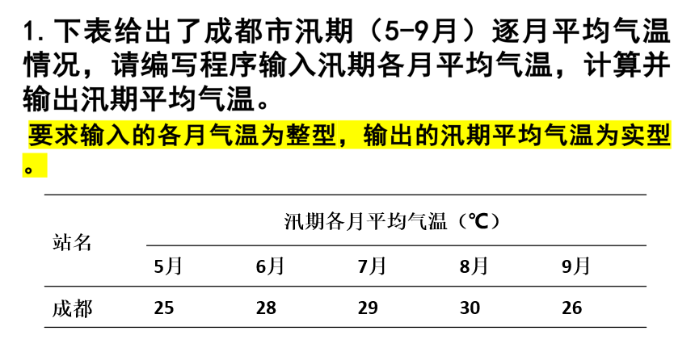

[title]:Fortran复习资料
[time]:2024年12月7日
[author]:pfolg@foxmail.com

2024年12月

# 写在前面
我（个人）写这个复习资料，~~其实就是为了单纯的写复习资料，并不是为了名垂千古，~~ 
一般人可以随便使用。当然我也是一个大学生，也可能跟你们同年级，也可能是同班同学，简言之，我资历尚浅，如果有些总结不到位的地方，欢迎提出，我们一起学习进步。
当然，你要是背着我骂这份复习资料也是可以的，毕竟我也是半生不熟的去搞这个，顺便就复习了。
**哎，好纠结啊，不知道该说什么。**
既然说到这里，那我就必须得吐槽一下了，咱们这门课居然是**笔试**，私密马赛，我笑了。我觉得保不齐都该用电脑来敲一敲代码吧，手写的话我是真的——对不起，我又笑了。

虽然他粗糙了一点，但是如果你确实没有看的，你可以将就着用。

如果你刚刚打开这个文档的时候，发现自己有可能会看不懂这些内容吧，那你可以仔细研究一下这个文档的后缀名，看上去是个 md 是吧？
然后就学习一下 md 该怎么读，如何读，用什么软件来读。看起来入门好像有点难啊，不过**我就是喜欢用 md 文档来写这些!**

# Content
## 一
程序=算法+数据结构+开发环境

仔细想一想，有哪些开发环境？
visual studio，VS code，Intel HPC，Intel Base，gfortran……

---
面向对象的程序设计过程应包括以下基本步骤：分析问题->建立数学模型->类的构建->编写程序->
调试运行->分析结果->写出程序文档
## 二
一般的一个有效的算法，应包括5个主要特征：有穷性，确定性，可行性，有零个或多个输入，有一个或多个输出

---
程序的三种基本结构：顺序结构，选择结构和循环结构

---
## 三
fortan 程序设计过程 详见书【Fortran语言程序设计 气象出版社】21页 5点

固定格式是Fortran 90以前版本使用的，如Fortran 77。
fortran 90以后，新增了自由格式，对源代码的格式要求降低，改善了编写代码的灵活性
## 四
fortran 语言的发展 详见书40页 6*

---
fortran 90/95语言的特点，详见书41页 3*

---
什么是固定格式？p43

自由格式？p44

---
fortran 语言源程序的结构
p45
~~~Fortran
主程序
program HelloWorld/程序名
    ! 声明/声明语句
    ! 主程序/执行语句

end HelloWorld/程序名
辅程序
SUBROUTINE 子程序
FUNCTION 函数
BLOK DATA
…
~~~

---
注释 p47

以感叹号开始的语句作为注释

---

## 五
### 字符集与保留字 p49  
|项目|内容|
|:---:|:---:|
|英文字母|A-Z及a-z（大小写不区分）|
|阿拉伯数字|0-9|
|特殊符号|空格 = + - * ? () , ' : " ! & ; < > $ ? _|

---

---
关于变量的内容，可以从书第51页开始翻 

---
运算符与表达式，可以从书的第61页开始翻

括号有最高优先级

逻辑运算符在第66页

---
程序控制语句在第70页

program，end，stop，pause，goto

---
系统内部函数在第72页，当然，书后面的附录也有

## 六 顺序结构程序设计 p75

## 七 选择结构程序设计 p99

if，双分支 if 结构，多分支块 if 结构，逻辑 if 结构：只用一行表示一个选择结构，只考虑条件为真的情况；

他们都可以嵌套使用？这是我自己下的结论

注意 select-case 语句
## 八 循环结构程序设计 p117

###  do
~~~Fortran
do v=e1,e2[,e3] !初值，终值，步长
    循环体
end do
~~~
eg. 这里可能包含有 [i-n 规则](https://baike.baidu.com/item/I-N%E8%A7%84%E5%88%99/7208085)，
~~~fortran
do n=1,30,1
    read*,num,grade
    print*,num,grade
end do
~~~
### do while
~~~Fortran
do while(逻辑表达式)
    循环体
end do
~~~
eg.循环输出十以内的数：
~~~Fortran
program test
    integer::i=0
    do while(i<10)
        print*,i
        i=i+1
    end do
end program test
~~~
### 循环流程控制语句
exit：类比 python 的 break，退出循环

cycle：类比 python 的 continue，跳过本次循环，开始下一次循环
### 无循环变量的 do 语句 p131
无循环变量的 do 循环语句不指定循环次数或循环条件。表面上看，这种循环语句将产生死循环，不会有参么使用价值。实际上，对于这种循环语句，如果在循环体中适当使用一个 exit 语句，不但不会产生死循环，而且还会使循环变得短小，简洁，清晰，~~（NB，高效，还能炫技……）~~
~~~Fortran
do
    循环体
end do
~~~
### 循环的嵌套 p132
## 九 数组 p148
~~数组其实就是一组数，~~ **按列存放**
### 使用 DATA 语句赋初值 p161
给变量 a,b,c 全部赋值为-1.0，给变量 d 赋值为2.5,e 赋值为5.8
~~~Fortran
real a,b,c,d,e
DATA a,b,c/-1.0,-1.0,-1.0/,d,e/2.5,5.8/
或者
DATA a,b,c/3*-1.0/,d,e/2.5,5.8/
~~~
### 使用数组赋值符赋初值 p163
数组赋值符是由括号和除号之间的初值表组成，初值表中可以使用常量\符号常量、常量表达式或隐含do循环，但不能使用变量，不能省略“::”，这种方法每个值都必须赋值。
eg.
~~~Fortran
integer::a(5)=(/1,2,3,4,5/)
integer,parameter::B=6
integer::a(5)=(/B*2,(i,i=2,4),5*2/)!a1=12，a2=2，a3=3，a4=4，a5=10
~~~
### 动态数组 p164
---
## 十 子程序 p188

你需要先弄懂什么是实参，什么是虚参。这一点，你可以参考 Python 的局部变量和全局变量。也可以参考 Java 的成员变量和静态变量（好像是，毕竟我也学得不扎实）

### 外部函数子程序 p189
~~~Fortran
[类型] FUNCTION 函数名[(虚参表)]
    说明语句
    执行语句
end [FUNCTION [函数名]]
~~~
使用函数名加实参调用：x=fun(a,b,c)

---
### 外部子例行程序 p192
~~~Fortran
SUBROUTINE 子例行程序名([虚参表])
    说明语句
    执行语句
end [SUBROUTINE 子例行程序名]
~~~
使用 call 调用：CALL exampleFunction

---
### 递归子程序 p209
在一个子程序中，直接或间接地调用子程序自身称为递归调用。允许递归调用的子程序称为递归子程序
~~~Fortran
RECURSIVE SUBROUTINE 子例行程序名([虚参表]) !RECURSIVE是标志！！！
    说明语句
    执行语句
end SUBROUTINE 子例行程序名
~~~

递归函数 p211

---
### 内部子程序 p216
+ 内部子程序的定义应当位于调用程序单元中的 CONTAINS 语句之后；
+ 内部子程序中不能再包含内部子程序；
+ end 语句中的关键字 function 或 subroutine 在外部子程序中是可选项，但在内部子程序中是必选项。

其基本结构与外部子程序类似

---
## 十一 指针
这一章老师没讲，考不考我不知道，不过我个人认为大概率是不考的。
既然都到这里了，还是得扯两句，很多编程语言都有指针，但是我没有去学 c ，目前我学的这三种语言当中，他们都绕开了指针这个东西，就是说本人对指针的理解仅限于名词这个玩意儿。所以如果你要问我啥是指针，那么我只能说指针就是指针。
## 十二 文件 p272
### open p276
open 语句内有多个参数，具体的内容请看书上的讲解
### close p280
### read/write p280
### 文件的使用 6种类型 p286

---
**常用库函数 p456**

大概是结束了吧。~~想得美，杂鱼~ （虽然这两个字从我这个大男人口中说出来，有点别扭）~~ 
但是呢，咱们现在离考试的要求应该差的还是比较远的。
只是想凭借这一点点的知识点，我那个填空判断还可能可以将就，不过我也不敢说全部能过。
毕竟嘛，我也是第一次上大学，我也是第一次学这个课程，我甚至……不对，我没有参加过这个考试。
简而言之——还得练（**菜，就多练；玩不起，就NB了再玩**）。

**看看右边的滑条吧**
# Practice
以下内容为本人实验课所提交过的报告，如有谬误，还请指正。

阅读方式：题目-程序-运行结果

---
## 报告一二
### 1

~~~Fortran
program experiment1
    implicit none
    integer mon(5),i,sum
    real avg
    sum=0
    print*,"输入汛期各月气温："
    read(*,*)mon
    do i = 1, 5
        sum=sum+mon(i)
    end do
    avg=sum/5
    print*,"汛期平均气温为：",avg
end program experiment1
~~~
~~~shell
 输入汛期各月气温：
25,28,29,30,26
 汛期平均气温为：   27.0000000    
~~~
---
### **P74，习题2，自定义变量，写出完整程序，自己给变量赋值并运行**
~~~fortran
program experiment1
    implicit none
    real::x=3,y=4,z=5,w=6,a=7,b=2,c=9,d=10,f1,f2,f3,f4,f5,f6
    f1=x**2-2*x*y+y**2
    f2=(-b+sqrt(b**2-4*a*c))/(2*a)
    f3=abs(x**4+y**3-z**2+3*w)
    f4=sqrt((a*b-c*d)*(a-c)/((a*c+b)*(a+b)))
    f5=tan(3*c-b)+1/(1+1/(1+d))
    f6=cotan(x**(a+b)-3*sin(y)*cos(x))
    print*,f1,f2,f3,f4,f5,f6
end program experiment1
~~~
~~~shell
   1.00000000                  NaN   138.000000      0.509734333      0.783140242     -0.249269366  
~~~
---
### **P74，习题5**
~~~fortran
program experiment1
    implicit none
    ! 摄氏温度与华氏温度的转换
    integer::hua(4)=(/10,40,100,180/),i
    real c(4)
    do i = 1, size(hua)
        c(i)=(hua(i)-32)*5/9
        print*,"华氏度",hua(i),"等于",c(i),"摄氏度"
    end do
end program experiment1
~~~
~~~shell
 华氏度          10 等于  -12.0000000     摄氏度
 华氏度          40 等于   4.00000000     摄氏度
 华氏度         100 等于   37.0000000     摄氏度
 华氏度         180 等于   82.0000000     摄氏度
~~~
---
### 4

~~~fortran
program experiment2
    implicit none
    ! 已知U=100v, R1=20Ω，R2=50 Ω, R0=100 Ω 。求等效电阻R和总电流I。
    integer ::U=100,R1=20,R2=50,R0=100
    real R,I
    R=R0+R1*R2/(R1+R2)
    I=U/R
    print*,"等效总电阻为：",R,"总电流为：",I
end program experiment2
~~~
~~~shell
 等效总电阻为：   114.000000     总电流为：  0.877192974    
~~~
### **P97，习题7**
~~~Fortran
program experiment2
    implicit none
    real R,C,S,pi
    parameter(pi=3.141592654)
    print*,"请输入圆的半径："
    read*,R
    C=2*pi*R
    S=pi*R**2
    print*,"圆的周长：",C,"  圆的面积为：",S
end program experiment2
~~~
~~~shell
 请输入圆的半径：
10
 圆的周长：   62.8318558       圆的面积为：   314.159271   
~~~
---
### 6

~~~fortran
program experiment3
    implicit none
    real price,weight,discount,freight,s
    print*,"请输入基本运费，货物总量，运输距离："
    read*,price,weight,s
    ! 2RMB/kg,3000kg,1897km
    select case(int(s))
    case(0:249)
        discount=0
    case(250:499)
        discount=2/100
    case(500:999)
        discount=5/100
    case(1000:1999)
        discount=8/100
    case(2000:2999)
        discount=1/10
    case default
        discount=15/100
    end select

    freight=price*weight*s*(1-discount)
    print*,"基于您输入的数据，总运费为：",freight
end program experiment3
~~~
~~~shell
 请输入基本运费，货物总量，运输距离：
2,3000,1897
 基于您输入的数据，总运费为：   11382000.0    #有点贵？！
~~~
---
### 输入5个年份，分别判断每一个输入的年份是否是闰年，并输出结果。
如何判断闰年，请使用现有的工具做查询
~~~Fortran
program experiment3
    implicit none
    ! 输入5个年份，分别判断每一个输入的年份是否是闰年，并输出结果。
    integer year(5),i
    read*,year
    do i = 1, size(year)
        if ( mod(year(i),4)==0 ) then
            print*,year(i),"是闰年"
        else
            print*,year(i),"不是闰年"
        end if
    end do
end program experiment3
~~~
~~~shell
2021,2022,2023,2024,2025
        2021 不是闰年
        2022 不是闰年
        2023 不是闰年
        2024 是闰年
        2025 不是闰年
~~~
---
### 改写上一题，找出公元2000年到公元3000年中的闰年并输出到屏幕上
~~~Fortran
program experiment4
    implicit none
    ! 改写实验三第2题，找出公元2000年到公元3000年中的闰年并输出到屏幕上
    integer i
    do i = 2000, 3000
        if (mod(i,4)==0)print*,i,"是闰年"
    end do
end program experiment4
~~~
~~~shell
        2000 是闰年
        …… # 由于结果太多，这里省略了
        3000 是闰年
~~~
---
### **P146习题3**，可以用递归实现吧
~~~Fortran
program experiment4
	! 这个是question9的修正版本
    ! implicit none
    real x,y
    integer n,i,j
    print*,"请输入x和n："
    read*,x,n
    y=0
    j=0
    do i = 1, n
        call func((2*i-1),j)
        y=y+(-1)*(i-1)*x*(2*i-1)/j
        j=0
    end do
    print*,"Sinx的近似值为：",y
end program experiment4
recursive subroutine func(arg,retval) ! 递归
    integer, intent(in) :: arg
    integer, intent(out) :: retval
        if (arg==1)then
            retval=arg
        else
            call func(arg-1,retval)
            retval=retval*arg
        end if
end subroutine func
~~~
我感觉这个结果多少还是有点问题的
~~~shell
 请输入x和n：
2,10
 Sinx的近似值为：  -1.17520344    
~~~
---
### **P146习题13**
~~~fortran
program experiment4
    implicit none
    integer ::n=100,i
    real::a,s=0,x=1
    print*,"ÇëĘäČëa,nŁŹ0<=a<=9"
    read*,a,n
    do i = 1, n
        x=x*a
        s=x+s    
    end do
    print*,s
end program experiment4
~~~
~~~shell
 请输入a,n，0<=a<=9
3,2 # 3+3*3
   12.0000000    
~~~
---
## 报告三四
### 1.P146，习题2
~~~fortran
program experiment1
    ! implicit none
    integer::n=100
    real::sum=1,x
    do i=1,n
        sum=sum*((2*i)*(2*i)/((2*i-1)*(2*i+1)))
    end do
    x=sum*2
    print*,x
end program experiment1
~~~
~~~shell
2.00000000
~~~   
### 2.P147，习题12
~~~fortran
! F(0) = 0, F(1) = 1
! 对于 n > 1, F(n) = F(n-1) + F(n-2)
program experiment1
    ! implicit none
    integer::f0=0,f1=1,fn=0
    integer::count=2  ! 初始有两项

    do while(fn<4000)
        fn=f0+f1
        f0=f1
        f1=fn
    end do
    print*,"大于4000的最小项为",fn

    f0=0
    f1=1
    fn=0
    do while(fn<5000)
        fn=f0+f1
        f0=f1
        f1=fn
        count=count+1
    end do
    print*,"5000之内的项数有：",count

end program experiment1
~~~
~~~
 大于4000的最小项为        4181
 5000之内的项数有：          21
~~~
### 3.P186，习题1(要求输出结果)
~~~fortran
program experiment1
    ! implicit none
    integer x(5,5),y(5,5),z(5,5)
    DATA y/1,6,11,16,21,2,7,12,17,22,3,8,13,18,23,4,9,14,19,24,5,10,15,20,25/ ! 按列赋值
    do i = 1, 5
        do j = 1, 5
            x(i,j)=y(i,j)
            z(i,j)=y(j,i)
        end do
    end do
    print*,"按行输入、输出："
    write(*,10)x
    10 format(5I4)
    print*,"按列输入、输出："
    write(*,20)z
    20 format(5I4)
    print*,"主对角线上的元素有："
    do i=1,5
        print*,y(i,i)
    end do
    print*,"次对角线上的元素有："
    do i = 1, 5
        print*,y(6-i,i)
    end do
    print*,"上三角阵上的元素有："
    do i = 1, 5
        do j = 1, 5
            if(i<=j)print*,y(i,j)
        end do
    end do
end program experiment1
~~~
~~~shell
按行输入、输出：
   1   6  11  16  21
   2   7  12  17  22
   3   8  13  18  23
   4   9  14  19  24
   5  10  15  20  25
 按列输入、输出：
   1   2   3   4   5
   6   7   8   9  10
  11  12  13  14  15
  16  17  18  19  20
  21  22  23  24  25
 主对角线上的元素有：
           1
           7
          13
          19
          25
 次对角线上的元素有：
          21
          17
          13
           9
           5
 上三角阵上的元素有：
           1
           2
           3
           4
           5
           7
           8
           9
          10
          13
          14
          15
          19
          20
          25
~~~
### 4.P181，例题9.12（要求自行规定数组维数，输出矩阵C的数学形式，不要使用内部函数）
~~~fortran
program experiment1
    integer a(2,3),b(3,2),c(2,2)
    DATA a/1,2,3,4,5,6/,b/11,12,13,14,15,16/
    do i = 1, 2
        do j = 1, 2
            c(i,j)=0
            do k = 1, 3
                c(i,j)=c(i,j)+a(i,k)*b(k,j)
            end do
        end do
    end do
    write(*,10)c
    10 format(2I4)
end program experiment1
~~~
~~~
 112 148
 139 184
~~~
### 5

~~~Fortran
program experiment2
    ! implicit none
    real::temp(4,4),dayMax(4),dayMin(4),max14=0,daySum(4),sum=0
    integer::data0=16,thedata
    DATA temp/28,29.8,28.1,29.9,32.9,31.8,32,33.4,36.8,36,35.1,36.2,33,31.1,32.3,32/
    do i = 1, 4
        dayMax(i)=temp(i,1)
        dayMin(i)=temp(i,1)
        daySum(i)=0
        do j = 1, 4
            daySum(i)=daySum(i)+temp(i,j)
            if (temp(i,j)>dayMax(i))dayMax(i)=temp(i,j)
            if (temp(i,j)<dayMin(i))dayMin(i)=temp(i,j)
            if (j==3)then
                if (temp(i,j)>max14)then
                    max14=temp(i,j)
                    thedata=data0+i
                end if
            end if
        end do
        sum=sum+daySum(i)
    end do
    print*,"每天的平均温度为："
    write(*,*)(daySum(i)/4,i=1,4)
    print*,"4天的平均温度：",sum/16
    print*,"下午14时的最高温度出现在",thedata,"号"
    print*,"气温日较差："
    write(*,*)(dayMax(i)-dayMin(i),i=1,4)
end program experiment2
~~~
~~~shell
 每天的平均温度为：
   32.6749992       32.1749992       31.8750000       32.8750000
 4天的平均温度：   32.4000015
 下午14时的最高温度出现在          17 号
 气温日较差：
   8.79999924       6.20000076       6.99999809       6.30000114
~~~
### 6

~~~Fortran
program experiment2
    real::temp(16),midtemp
    integer::day(16)=(/1,2,3,4,5,6,7,8,9,10,11,12,13,14,15,16/),i=0,j=0,midday
    DATA temp/13.3,17.2,21.9,21.8,22.5,23.7,25.2,27.4,27.4,24.4,21.5,22.2,24.1,23,22.5,19.5/
    do i=1,16
        do j=1,15
            if(temp(j+1)<temp(j))then
                midtemp=temp(j)
                temp(j)=temp(j+1)
                temp(j+1)=midtemp
                midday=day(j)
                day(j)=day(j+1)
                day(j+1)=midday
            end if
        end do
    end do
    do i = 1, 16
        write(*,10) 'Day:', day(i), '    Temperature:', temp(i)
    end do
    10 format(A, I4, A, F5.1)
end program experiment2
~~~
~~~
Day:   1    Temperature: 13.3
Day:   2    Temperature: 17.2
Day:  16    Temperature: 19.5
Day:  11    Temperature: 21.5
Day:   4    Temperature: 21.8
Day:   3    Temperature: 21.9
Day:  12    Temperature: 22.2
Day:   5    Temperature: 22.5
Day:  15    Temperature: 22.5
Day:  14    Temperature: 23.0
Day:   6    Temperature: 23.7
Day:  13    Temperature: 24.1
Day:  10    Temperature: 24.4
Day:   7    Temperature: 25.2
Day:   8    Temperature: 27.4
Day:   9    Temperature: 27.4
~~~
### 7

~~~fortran
program experiment2
    real::rain(24)=(/939.33,996.02,1011.34,913.93,961.35,861.69,813.29,1180.49,1028.46,961.55,985.19,903.12,&
    944.92,974.03,1091.93,785.4,1006.75,1038.67,966.79,1069.48,940.17,1076.74,1169.35,1126.18/),midrain,sum,&
    average,sum2=0
    integer::year(24)=(/1991, 1992, 1993, 1994, 1995, 1996, 1997, 1998, 1999, 2000, 2001, 2002, 2003,&
     2004, 2005, 2006, 2007, 2008, 2009, 2010, 2011, 2012, 2013,2014/),midyear,location
    do i2=1,24
        midrain=0
        do j = i2, 24
            if(rain(j)>midrain)then
                midrain=rain(j)
                midyear=year(j)
                location=j
            end if
        end do
        rain(location)=rain(i2)
        year(location)=year(i2)
        rain(i2)=midrain
        year(i2)=midyear
    end do
    

    do k = 1, 24
        print*,"年份：",year(k),"降水量：",rain(k)
        sum=sum+rain(k)
    end do
    average=sum/24
    print*,"平均降水量为：",average
    print*,"低于平均降水量的年份及降水量："
    do index = 1, 24
        if (rain(index)<average)print*,"年份：",year(index),"降水量：",rain(index)
    end do
    do i = 1, 23
        sum2 = sum2 + (rain(i+1) - rain(i))
    end do
    print *, "累积距平值：", sum2
end program experiment2
~~~
~~~
 年份：        1998 降水量：   1180.48999    
 年份：        2013 降水量：   1169.34998    
 年份：        2014 降水量：   1126.18005    
 年份：        2005 降水量：   1091.93005    
 年份：        2012 降水量：   1076.73999    
 年份：        2010 降水量：   1069.47998    
 年份：        2008 降水量：   1038.67004    
 年份：        1999 降水量：   1028.45996
 年份：        1993 降水量：   1011.34003
 年份：        2007 降水量：   1006.75000
 年份：        1992 降水量：   996.020020
 年份：        2001 降水量：   985.190002
 年份：        2004 降水量：   974.030029
 年份：        2009 降水量：   966.789978
 年份：        2000 降水量：   961.549988
 年份：        1995 降水量：   961.349976
 年份：        2003 降水量：   944.919983
 年份：        2011 降水量：   940.169983
 年份：        1991 降水量：   939.330017
 年份：        1994 降水量：   913.929993
 年份：        2002 降水量：   903.119995
 年份：        1996 降水量：   861.690002
 年份：        1997 降水量：   813.289978
 年份：        2006 降水量：   785.400024
 平均降水量为：   989.423645
 低于平均降水量的年份及降水量：
 年份：        2001 降水量：   985.190002
 年份：        2004 降水量：   974.030029
 年份：        2009 降水量：   966.789978
 年份：        2000 降水量：   961.549988
 年份：        1995 降水量：   961.349976
 年份：        2003 降水量：   944.919983
 年份：        2011 降水量：   940.169983
 年份：        1991 降水量：   939.330017
 年份：        1994 降水量：   913.929993
 年份：        2002 降水量：   903.119995
 年份：        1996 降水量：   861.690002
 年份：        1997 降水量：   813.289978
 年份：        2006 降水量：   785.400024
 累积距平值：  -395.089966
~~~
### 8

~~~fortran
program experiment2
    real::rain(10)=(/1.6,0.0,0.0,6.2,85.9,35.0,12.3,0.0,0.0,23.3/),rs1=0,rs2=0,rs3=0,rs4=0,rs5=0,rs6=0,&
    ph(6)=(/5.5,5.4,5.5,6.2,6.5,5.7/)
    integer::sum1=0,sum2=0,sum3=0,sum4=0,sum5=0,sum6=0,count=0
    do i = 1, 10
        if (rain(i)<10.0)then
            sum1=sum1+1
            rs1=rs1+rain(i)
        else if(rain(i)<25.0)then
            sum2=sum2+1
            rs2=rs2+rain(i)
        else if(rain(i)<50.0)then
            sum3=sum3+1
            rs3=rs3+rain(i)
        else if (rain(i)<100.0)then
            sum4=sum4+1
            rs4=rs4+rain(i)
        else if (rain(i)<250.0)then
            sum5=sum5+1
            rs5=rs5+rain(i)
        else
            sum6=sum6+1
            rs6=rs6+rain(i)
        end if
    end do
    do i=1,size(ph)
        if (ph(i)<5.6)count=count+1
    end do
    print*,"小雨",sum1,"天，平均降水：",rs1/sum1,"mm"
    print*,"中雨",sum2,"天，平均降水：",rs2/sum2,"mm"
    print*,"大雨",sum3,"天，平均降水：",rs3/sum3,"mm"
    print*,"暴雨",sum4,"天，平均降水：",rs4/sum4,"mm"
    print*,"大暴雨",sum5,"天，平均降水：",rs5/sum5,"mm"
    print*,"特大暴雨",sum6,"天，平均降水：",rs6/sum6,"mm"
    print*,"酸雨日数：",count
end program experiment2
~~~
~~~
 小雨           6 天，平均降水：   1.29999995     mm
 中雨           2 天，平均降水：   17.7999992     mm
 大雨           1 天，平均降水：   35.0000000     mm
 暴雨           1 天，平均降水：   85.9000015     mm
 大暴雨           0 天，平均降水：              NaN mm
 特大暴雨           0 天，平均降水：              NaN mm
 酸雨日数：           3
~~~
### 9

~~~fortran
program experiment3
    character(len=10)::day(5),midDay
    real::maxTemp(5),minTemp(5),avg(5),max
    integer::locaton
    read*,(day(i),maxTemp(i),minTemp(i),i=1,5)
    do index = 1, 5
        avg(index)=(maxTemp(index)+minTemp(index))/2
    end do
    open(10,file="qiwen.txt")
    write(10,*)(avg(i),i=1,5)
    close(10)
    do j=1,5
        max=0
        do k=j,5
            if (avg(k)>max)then
                max=avg(k)
                locaton=k
            end if
        end do
        midDay=day(locaton)
        avg(locaton)=avg(j)
        day(locaton)=day(j)
        avg(j)=max
        day(j)=midDay
    end do
    print*,"日期     日平均温度"
    do l = 1, 5
        print*,day(l),avg(l)
    end do
end program experiment3
! 2009-07-16 32.3 20.2
! 2009-07-17 35 23.3
! 2009-07-18 33.3 22.5
! 2009-07-19 35.6 26.8
! 2009-07-20 36 28
~~~
~~~
2009-07-16,32.3,20.2
2009-07-17,35,23.3
2009-07-18,33.3,22.5
2009-07-19,35.6,26.8
2009-07-20,36,28
 日期     日平均温度
 2009-07-20   32.0000000    
 2009-07-19   31.1999989
 2009-07-17   29.1499996
 2009-07-18   27.8999996
 2009-07-16   26.2500000
~~~
txt
~~~txt
   26.2500000       29.1499996       27.8999996       31.1999989       32.0000000    
~~~
### 10

~~~fortran
program experiment3
    integer::year(20)
    real::rain(20,12)
    open(10,file="56158.txt")
    do i=1,21
        read(10, *)! 丢弃21行数据
    end do
    read(10,100)(year(i), (rain(i,j),j=1,12),i=1,20)
    100 format(I4,2X,12F6.1)
    open(12,file="rain.dat")
    write(12,*)((rain(i,j),j=1,12),i=1,20)
    close(12)
    write(*,200)(year(i), (rain(i,j),j=1,12),i=1,20)
    200 format(I4,2X,12F6.1)
    call routine1(year,rain)
    call routine2
end program experiment3
subroutine routine1(arg1,  arg2)
    integer:: arg1(20),location,midYear
    real::  arg2(20,12),yearSum(20),yearMax

    do index = 1, 20
        yearSum(index)=0
        do j = 1, 12
            yearSum(index)=yearSum(index)+arg2(i,j)
        end do
    end do
    do m=1,20
        yearMax=0
        do n=m,20
            if(yearSum(n)>yearMax)then
                yearMax=yearSum(n)
                location=n
            end if
        end do
        midYear=arg1(location)
        yearSum(location)=yearSum(m)
        arg1(location)=arg1(m)
        yearSum(m)=yearMax
        arg1(m)=midYear
    end do
    open(10,file="output.txt",form="formatted")
    write(10,*)(arg1(i),yearSum(i),i=1,20)
    close(10)
end subroutine routine1
subroutine routine2
    integer::year(54)
    real::rain(54,12),yearRain(54),sum=0,delta(53)
    open(10,file="56158.txt")
    read(10, *)! 丢弃第一行数据
    read(10,100)(year(i), (rain(i,j),j=1,12),i=1,54)
    100 format(I4,2X,12F6.1)
    do i=1,54
        sum=0
        do j=1,12
            sum=sum+rain(i,j)
        end do
        yearRain(i)=sum/12
    end do
    do j = 1, size(yearRain)-1
        delta(j)=yearRain(j)-yearRain(j+1)
    end do
    print*,"        年份    平均降水量    距平值"
    do k=1,size(year)
        if (k>1)then
            print*,year(k),yearRain(k),delta(k-1)
        else
            print*,year(k),yearRain(k)
        end if
    end do
end subroutine routine2
~~~
output.txt
~~~
        1981   462.229980            1982   462.229980            1983   462.229980            1984   462.229980            1985   462.229980            1986   462.229980            1987   462.229980            1988   462.229980            1989   462.229980            1990   462.229980            1991   462.229980            1992   462.229980            1993   462.229980            1994   462.229980            1995   462.229980            1996   462.229980            1997   462.229980            1998   462.229980            1999   462.229980            2000   462.229980    
~~~
rain.dat
~~~
   1.00000000       8.00000000       16.8999996       11.5100002       28.8099995       28.7099991       29.7099991       49.9000015       98.8000031       43.7999992       2.29999995       1.89999998       0.00000000       7.50000000       1.29999995       38.9000015       19.5200005       6.30999994       70.5999985       77.7099991       33.2000008       28.0000000       7.69999981       2.29999995       5.30000019       4.90000010       18.7999992       9.19999981       25.9099998       51.9099998       79.3000031       98.9000015       79.6999969       8.60000038       2.20000005      0.699999988      0.100000001      0.200000003       22.1000004       24.6000004       95.5100021       43.4099998       69.5999985       43.0999985       95.8000031       44.5000000       1.10000002       0.00000000       2.79999995       1.00000000       75.5999985       23.1100006       2.00999999       77.8099976       89.7099991       73.8099976       46.7000008       19.7000008       2.20000005       4.00000000       5.59999990       3.59999990       1.89999998       33.7999992       70.0100021       1.10000002       84.0100021       19.0100002       10.1000004       43.5000000       5.69999981      0.100000001       1.00000000      0.699999988       11.5000000       39.2000008       27.8099995       60.3100014       57.5099983       3.00999999       36.2000008       8.69999981       6.00000000       2.90000010       7.00000000       3.50000000       18.7000008       62.5999985       90.8099976       9.51000023       37.9099998       21.5100002       33.4000015       21.2999992       3.20000005       0.00000000       13.6999998       6.69999981       13.3000002       79.0100021       9.60999966       18.2999992       75.2099991       39.9099998       17.7999992       71.5000000       10.1000004       2.29999995       1.70000005       7.69999981       1.70000005       54.4000015       55.9099998       73.8099976       46.2099991       15.9099998       59.2999992       80.5999985       2.09999990       3.00000000       4.00000000       1.00000000       12.1999998       47.4000015       59.5099983       61.9000015       98.3000031       98.4100037       25.2999992       35.7000008       10.6000004       9.80000019       8.00000000       10.3000002       23.7000008       22.0000000       86.0100021       30.7099991       60.2000008       69.8099976       5.40000010       35.0999985      0.400000006      0.899999976       11.6000004       1.70000005       3.50000000       29.7999992       61.2099991       20.5200005       19.1100006       58.2099991       41.7099991       14.8999996      0.300000012       5.80000019       2.79999995       2.29999995       17.6000004       9.60000038       59.6100006       46.4000015       72.8099976       31.9099998       47.0000000       41.7000008       8.50000000      0.300000012       3.09999990       10.3999996       19.8999996       27.7000008       57.9099998       58.5000000       94.5000000       95.5100021       5.50000000       32.5000000       22.2000008       2.90000010       8.80000019       3.00000000       15.1000004       24.1000004       99.5000000       95.1100006       54.9000015       43.7099991       16.1000004       42.9000015       12.3000002       0.00000000       2.29999995       9.39999962       19.6000004       18.1000004       79.2099991       39.3100014       26.2999992       54.2000008       84.3000031       20.5000000       8.80000019       3.09999990       2.90000010       14.8000002       27.7999992       14.1000004       71.1100006       69.9199982       7.40999985       43.0999985       62.5000000       99.1999969       7.09999990       1.29999995       1.39999998       4.59999990       19.1000004       44.4099998       78.9100037       59.5099983       21.1100006       4.09999990       75.8000031       69.1999969       3.79999995       1.20000005       2.00000000       6.09999990       16.8999996       88.8000031       92.9100037       73.1100006       30.1100006       51.0000000       84.9000015       12.6000004       3.79999995      0.400000006    
~~~

---
# 写在最后
感谢你能看到这里，在这里我只想说，复制粘贴 yyds，555……