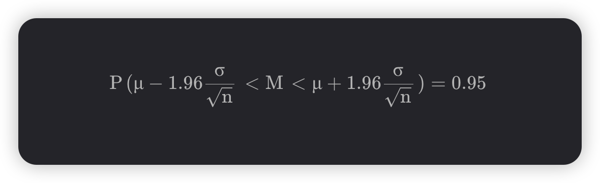

概率论：置信区间，Z检验

## 知识点：

置信区间：
均值 +- 1.96 * (标准差 % 根号N)

1.  x1，x2 ~ xn 是服从正态分布的独立样本，求的置信度为 `1- alpha` 的置信区间。
如果取得如下观测值：1.8, 2.1, 2.0, 2.2, 1.9, 2.2, 1.8，求的区间估计值。

95%的数据在这个1.96的范围内：


```r
# 输入数据
data <- c(1.8, 2.1, 2.0, 2.2, 1.9, 2.2, 1.8)

# 计算基本统计量
n <- length(data)          # 样本量
xbar <- mean(data)         # 样本均值
s <- sd(data)             # 样本标准差

# 设置置信水平（假设为95%）
alpha <- 0.05             # 显著性水平

# 计算置信区间
t_value <- qt(1-alpha/2, df=n-1)  # t分布临界值, 95%的时候是1.96
margin_error <- t_value * (s/sqrt(n))

# 计算置信区间的上下限
lower_bound <- xbar - margin_error
upper_bound <- xbar + margin_error

# 输出结果
cat("样本均值：", xbar, "\n")
cat("样本标准差：", s, "\n")
cat("95%置信区间：[", lower_bound, ",", upper_bound, "]\n")
```

强记95%的情况下的置信区间公式即可；

95%置信度的临界值:
1.96 = qnorm(0.95)

2. 过去大量资料显示，菜厂生产的灯泡的使用寿命服从正态分布 N (1020, 100^2)。观从最近生产的一批产品中随机抽取 16 只，测得样本平均寿命为1080小时。试在0.05的显著性水平下判断这批产品的使用寿命是否有显著提高。(alpha=0.05)

```r
# 计算标准正态分布下，其左侧的数值
# 计算Z=1.96左侧的概率
pnorm(1.96)   # 返回约0.975

# 95%置信度的临界值
qnorm(0.975)  # 返回约1.96

# 这两个是互逆的
```

```r
# 已知数据
mu0 <- 1020      # 原假设的均值（ N (1020, 100^2）
xbar <- 1080     # 样本均值（测得样本平均寿命为1080小时）
n <- 16          # 样本量
sigma <- 100     # 假设总体标准差为100（ N (1020, 100^2）
alpha <- 0.05    # 显著性水平

# 计算Z统计量
z_stat <- (xbar - mu0)/(sigma/sqrt(n)) # (观测值 - 均值) / (总体标准差 / 根号N)

# 计算临界值（单侧检验）
# z_crit <- qnorm(1 - alpha)

# 计算p值
p_value <- 1 - pnorm(z_stat) # p是1.96 -> 0.975的运算

# 输出结果
cat("Z统计量：", z_stat, "\n")
cat("临界值：", z_crit, "\n")
cat("P值：", p_value, "\n")
cat("检验结果：", if(p_value < alpha) "拒绝原假设" else "接受原假设", "\n")
```

所以这题，比较p值和0.05即可，p值小于0.05就是拒绝原假设，灯泡寿命提高了；

p = 1 - pnorm(z值)

z值 = (观测值 - 均值) / (总体标准差 / 根号N)

