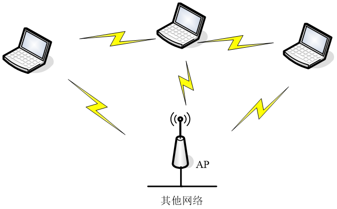
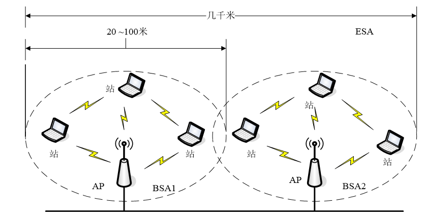
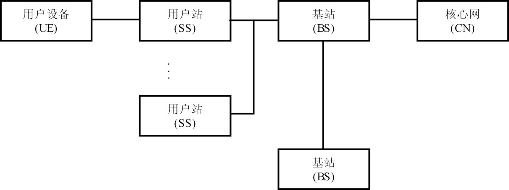
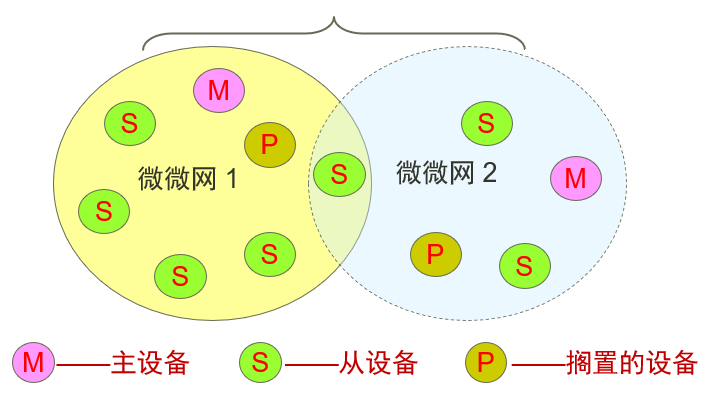
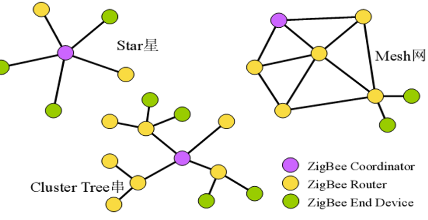

> Date: 2022/5/30

分数划分：

- 选择 10/2
- 判断 10/2
- 填空 10/1
- 名词解释 ?/?
- 简答 ?/?

### 第一章

#### 概念

IMP：接口信息处理机（Interface Message Processor， IMP）。

#### 无线网络分类

分类标准：

1. 使用的频率
2. 是否需要基础设施支持
3. 覆盖范围
4. 参与组网的对象
5. 技术特点

按覆盖范围：

- 系统部件互联/无线个域网
- 无线局域网
- 无线城域网/广域网

按照参与组网的对象进行分类：

- 计算机网络
- 卫星网络
- 手机网络
- 车联网
- 社交网络
- 物联网

按技术特点、应用领域分：

- Ad Hoc网络
- 无线传感器网络
- 无线Mesh网络
- 车联网（Vehicle Area Network， VAN）

#### 无线网络结构

大蜂窝（Megacell）：以卫星作为基站，单个基站覆盖距离可达上千千米。

宏蜂窝（Macrocell）：基站放置在高大建筑上，单个基站覆盖距离1~10千米。

微蜂窝（Microcell）：基站放置在几米到几十米高度上，覆盖范围几百米~1千米。

微微蜂窝（Picocell）/毫微微蜂窝（Femtocell）：基站往往布置在室内，用于改善室内信号覆盖较弱的问题。

#### 标准化组织

**国际电信联盟（International Telecommunication Union, ITU）**
政府机构、厂商、科学组织、运营商

**国际化标准组织（International Standard Organization, ISO）**
各国的标准化机构

**国际电工委员会 （International Electrical Commission, IEC）**
各国的标准化机构

**电气和电子工程师协会（Institute of Electrical and Electronics Engineers, IEEE）**
技术团体

**因特网体系委员会（Internet Architecture Board, IAB）**
政府机构

### 第二章

#### 概念

传输媒体：数据传输系统中发送器与接收器之间的物理路径。分为两类：导向性（有线）和非导向性（无线）。

无线传输定向结构：发射天线将电磁波聚集成波束后发射出去，因此，发射和接收天线必须精确校准。

无线传输全向结构：发送信号沿所有方向传播，并能够被多数天线接收到。

通常：低频信号为全向；高频信号为定向。这也是比较好理解的，高频波长短传输距离短，要汇聚一下提高传播距离。而低频信号波长长，适合全方位传播。

#### 损耗公式

$$
L=10\lg(\frac {4\pi d}{\lambda})^2dB
$$

#### 天线

天线是实现无线传输最基本的设备。天线可看作一条电子导线或导线系统，该导线系统或用于将电磁能辐射到太空或用于将太空中的电磁能收集起来。

**偶级天线**

偶极天线是一个直接的导电体，信号由天线底部输入，可水平、垂直定向或者倾斜一定的角度，场强分布几乎是圆形。偶极天线结构简单，馈电方便，在近距离通信中应用较多。

**天线长度**

求2.4GHz 半波偶极天线的长度。

由$c=\lambda f$（其中c为波传播速度，f为频率）可求出波长：

$$
\lambda=c/f=\frac{300,000,000 m/s}{2.4 GHz}=\frac{300,000,000 m/s}{2,400,000,000 Hz}=0.125m
$$

之后便可计算长度：

$$
L=\lambda/2=0.0625m
$$

由天线辐射出去的信号以三种方式传播：

- 地波(ground wave)：地波传播或多或少要沿着地球的轮廓前行，且可传播相当远的距离，较好地跨越可视的地平线。
- 天波(sky wave)：天波信号可以通过多个跳跃，在电离层和地球表面之间前后反弹地穿行。
- 直线LOS(line of sight) ：当要传播的信号频率在30MHz以上时，天波与地波的传播方式均无法工作，通信必须用直线方式。 

天线有五个基本参数：方向性系数、天线效率、增益系数、辐射电阻和天线有效高度。天线增益主要与天线**有效面积**成正比。

#### 传播距离计算

两个天线（两个天线的高度分别为*h*1和*h*2）之间直线传播的最大距离是（K = 4 / 3）：
$$
d=3.57(\sqrt{Kh_1}+\sqrt{Kh_2})
$$

#### 多普勒效应

在无线移动通信中，当移动台移向基站时，频率变高，远离基站时，频率变低。多普勒效应不仅仅适用于声波，它也适用于所有类型的波，包括光波、电磁波。

#### 海明码计算

数据为1110，根据公式，$2^k-k \geq n+1$，其中k表示校验码位个数，n表示数据位个数，根据计算可以得出，$k=3$。

又因为校验位的位置下标为$2m (m=0,1,2....)$，所以下标分别为1，2，4

则位置表示为：

| 十进制下标 | 7    | 6    | 5    | 4    | 3    | 2    | 1    |
| ---------- | ---- | ---- | ---- | ---- | ---- | ---- | ---- |
| 二进制下标 | 111  | 110  | 101  | 100  | 011  | 010  | 001  |
| 位置标记   | D4   | D3   | D2   | P3   | D1   | P2   | P1   |
| 记录值     | 1    | 1    | 1    | ?    | 0    | ?    | ?    |

1）因为P1的下标二进制值为001，则由下标二进制值第一位为1的位异或计算得出，即$P1 = D1 \bigoplus D2 \bigoplus D4=0$

2）同理如上，由下标二进制值第二位为1的位异或计算得出，即$P2 = D1 \bigoplus D3 \bigoplus D4=0$

3）同理如上，由下标二进制值第三位位1的位异或计算得出，即$P3 = D2 \bigoplus D3 \bigoplus D4=1$

所以最终计算可得出附加纠错码后的值为：1111000

#### 扩频

扩频方式有两种：

- 跳频（Frequency-hopping spread spectrum，FHSS）
- 直接序列扩频（简称直序扩频，Direct-sequence spread spectrum，DSSS）

#### 模拟数据与模拟信号

当数据已是模拟形式时，调制的主要原因有两个：(1) 为了实现有效的传输，可能需要较高的频率。(2) 调制允许使用频分复用技术，可以提高信道的利用率。

模拟数据的调制技术：调幅(AM)、调频(FM)和调相(PM)。

数字数据转化为模拟信号：数字设备通过调制解调器与网络相连，调制解调器将数字数据转换成模拟信号，或将模拟信号转换成数字数据。

调制技术涉及对载波信号的3个特性：幅移键控(ASK)、频移键控(FSK)和相移键控(PSK) 。

#### 复用与多址

复用：多个信号使用同一信道互不干扰的同时传输

- 频分复用
- 时分复用
- 码分复用
- 空分复用

多址：多点间进行多边通信

- 频分多址
- 时分多址
- 码分多址
- 空分多址

### 第三章

#### 隐蔽终端与暴露终端

隐藏终端问题可以简单定义为：节点之间无法互相监听对方。但当其不可以同时传输时，其同时传输，从而导致冲突发生。隐藏终端在单个AP（或者单个Receiver）时就有可能发生。

暴露终端问题可以简单定义为：节点之间能够互相监听对方。可以同时传输时，但其不传输，从而造成浪费。暴露终端在多个AP（或者多个Receiver）时才有可能发生。

#### 常见术语解释

dBm：功率单位，衡量信号大小，转换：$0dBm=1mw=\frac{1}{1000}w$。

dBi/dBd：功率增益单位。dBi参考基准是全向天线；dBd参考基准是偶极天线。

ISM频段：即工业,科学和医用频段。ISM频段在各国的规定并不统一。

SISO：指单输入单输出。

MIMO：指多输入多输出。它能够更好地利用空间维度的资源、提高频谱效率，在不增加系统带宽和发送功率的情况下，显著提升传输性能。

#### 天线越多路由就越好？

不是，同频天线不能超过4根。

#### 802.11ax

MU-MIMO（多用户-多输入多输出）

SI-MIMO（单用户-多输入多输出）

#### 无线局域网的组成四大部分

1. 站（Station, STA）、主机（Host）或终端（Terminal）
2. 无线介质（Wireless Medium, WM）
3. 基站（Base Station, BS）或接入点（Access Point, AP）
4. 分布式系统DS（Distribution System）

#### 无线局域网的逻辑结构

基本服务集BSS： 无线局域网的最小构件是基本服务集BSS(Basic Service Set)。   一个BSS至少包含一个AP，AP作为中心站。

扩展服务集ESS：ESS(Extended Service Set)是由多个BSS通过有线、无线的方式组成的多区网（更大的服务集）：

#### 无线局域网的服务（简答题）

STA服务

- 站、AP
- 认证/解除认证/保密/数据传输

DSS服务（Distributed System Service, 分布式系统服务）

- AP
- 联接/重新联接/解除联接/分布/集成

#### SSID & BSSID

SSID(Service SetIDentifier)：服务集标识，一般指WLAN的名称。

BSSID(Basic Service SetIDentifier)：基础服务集标识，一般是AP的MAC地址，也就是无线路由器的MAC地址。

#### AP隔离

开启后同一无线网络内的电脑间不能互相访问。

#### 胖AP和瘦AP（判断、选择）

Fat AP单一大功率胖AP，胖AP是单个独立可以管理的无线AP。

1、瘦AP多用于要求较高的环境，要实现认证一般需要认证服务器或者支持认证功能的交换机配合。瘦AP需要专用无线控制器的，通过无线控制器下发配置才能用，里面本身不能进行相关配置，适合大规模无线部署。

2、胖AP多用于家庭和小型网络，功能比较全，一般一台设备就能实现接入、认证、路由、VPN、地址翻译，甚至防火墙功能。

#### Wi-Fi安全保护 / 安全访问机制

安全性比较：WPA2 > WPA > WEP。

WEP缺陷

- 认证类型：开放系统与共享密钥
- 四个密钥，但生效的只有一个
- RC4算法不安全
- 密钥长度：64位、128位与256位，包含24位的IV（Initial Vector）
- IV以明文形式传送

PSK与AS区别：PSK中不同用户采用统一密码认证，域共享，AS是不同用户不同密码，PSK不同用户最后产生的PSK都一样，AS因为PMK不一样产生的PTK也不一样。

#### 课堂小练习（一）

1. 对于PSK模式，不同用户，每次连接使用的密钥是相同的。🟢
2. 对于AS模式，不同用户，每次连接使用相同的账号和密码。🔴
3. 对于PSK模式，不同用户，每次连接生成PTK的PSK是相同的。🟢
4. 对于AS模式，不同用户，每次连接生成PTK的PSK(PMK)是不同的。🟢

#### WPA相对于WEP的改进

- WPA密钥长度变为了128位。
- 同一客户端每次连接使用的密钥不同，与STA、AP生成临时值，相对于WEP增加了动态性和强度。
- 使用了密码学方式生成的MIC，在不知道密钥的情况下无法伪造。
- WPA中，每一个数据包都具有48位序列号，序列号在每次传递新数据时递增，并被用作初始化向量和密钥的一部分，解决了WEP的“碰撞攻击”问题。

#### QSS

一种安全无线连接的配置方式，其通过PIN码来验证设备合法性，若合法则建立WPA2级别的安全连接。

QSS破解原理：

- PIN码是由8位数字构成的，并且第8位是前7位数字的校验和
- PIN码只有107=1千万种组合，强度不够
- 可以通过穷举无线路由器的PIN码的方式进行破解，穷举破解只需要$104+103=11000$次

#### 可增强Wi-Fi安全性的配置

- SSID隐藏
- 控制发射功率
- MAC地址过滤：无线MAC地址过滤与有线MAC地址过滤
- 提高认证密码强度，使用AS模式
- 关闭DHCP
- 关闭QSS
- 管理密码强度

#### IEEE 802.11（判断，简答）

把相对复杂的数据链路层和物理层进一步划分为

- 802.11链路控制层(LLC)
- 介质访问控制层(MAC)
- 物理层汇聚协议(PLCP)
- 物理介质依赖子层(PMD)

重点记前两层：802.11链路控制层(LLC)、介质访问控制层(MAC)。

##### LLC层

频段/编码/传输速率/物理帧格式。

##### MAC层

功能：

- 可靠的数据传输
- 访问控制
- 安全

可靠的数据传输：

功能：成功接收/顺序不变/内容正确
方式：接收确认（ACK）与重传/帧编号/校验码

接入控制：

- RTS（Request To Send）/CTS （Clear To Send）
- DCF（Distributed Coordination Function）
- PCF（Point Coordination Function）
- HCF （Hybrid Coordination Function）

#### 课堂小练习（二）

1. RTS/CTS机制可以解决暴露终端问题。🔴是解决隐蔽终端问题
2. DCF机制包含载波侦听、冲突检测以及二进制指数退避三方面内容。🟢
3. PCF机制中P（Point）指的就是无线路由器。🟢
4. 可靠的数据传输是接入控制需要解决的问题。🟢

#### ~~DIFS、PIFS、SIF、EIFS~~

SIFS：短帧间间隔。SIFS是最短的时间区段，用来间隔需要立即响应的帧，如控制帧（RTS/CTS/ACK）等。在帧交换顺序地两次传输之间使用最短间隔，可以防止其它正在等待介质的站点试图使用介质。

PIFS：集中协调功能帧间间隔，只能够由工作于PCF模式的站点来使用。
DIFS：分布协调功能帧间间隔，只能够由工作于DCF模式的站点来使用。
EIFS: 在前一帧出错的情况下，发送节点 不得不延迟 EIFS 而不是DIFS时间段，再发送下一帧。

#### 混杂模式和监听模式区别

**监听模式**：允许网卡不用连接wifi就可以抓取特性频道的数据，就是在空气中抓取某个波段的数据。可以用在破解wifi密码上。
**混杂模式（连接wifi）**：就是接收所有经过网卡的数据包，包括不是发给本机的包（本应该丢弃），即不验证MAC地址。

#### 课堂小练习（三）

1. 监听模式下能够接收局域网内目的地址不是本机的数据包。🔴
2. 混杂模式下能够不连接任何无线网络即可获取无线数据包。🔴
3. 抓取邮箱密码说明802.11在应用层与802.3是一致的。
4. 抓取数据包中含有信号强度、频段、信道等信息说明802.11在物理层和802.3是不一致的。
5. Radiotap Header包含了部分物理层、数据链路层信息。

### 第四章

#### 什么是QoS

- 质量服务，Quality of Service
- 是用来解决网络延迟和阻塞等问题的一种技术
- 对特定的无时间限制的应用系统，比如Web应用，或E-mail设置无必要
- 对关键应用和多媒体应用需要
- 当网络过载或拥塞时，QoS 能确保重要业务量不受延迟或丢弃，同时保证网络的高效运行

#### 802.16的QoS模式

每条连接都与一个数据服务相联系。每个数据服务都有一组与之相关联的QoS参数，这些参数对该服务的行为进行了量化规定。分以下四种：

1. 主动授予服务(Unsolicited Grant Service，UGS)：带宽固定，VoIP（Voice over IP）
2. 实时查询服务(Real-time Polling Service，RTPS)：带宽可变，视频流
3. 非实时查询服务(Non-Real-Time Polling Service，NRTPS)：带宽可变但有最低速率要求，FTP
4. 尽力而为(Best Effort，BE) ：无质量保证，Internet网页浏览服务、电子邮件

#### 802.16的网络组成

一个完整的802.16系统应包含的网络实体有：

- 用户设备(UE)
- 用户站(SS)
- 基站(BS)
- 核心网(CN)

#### WiMax vs Wi-Fi

##### 功率

- FCC规定WiFi的传输功率1~100mW

- FCC规定WiMax的传输功率可达100kW

##### 覆盖范围

- WiFi覆盖范围，几十到几千米
- WiMax
  - LoS服务半径6~10km，使用频率66GHz
  - NLoS服务半径50km，使用频率2~11GHz

#### 蜂窝的通话过程？

首先，用户设备会监听周边的基站的信号强度，并从选择信号强度最强的基站接入。

其次，用户设备通过基站发出连接请求，请求将会发送到移动电话交换局。

随后，MTSO会向辖区内基站发出寻呼请求，被呼叫用户将通过所在基站进行应答。

最后，双方借助各自所在基站与MTSO作为连接中介，就能建立连接并进行通话了，如果在通话过程中，某个用户因为移动进入另外基站的覆盖范围，将发生切换，即用户移出基站将向移入基站转移用户通信。

#### 课堂小测验（一）

以下关于WiMAX与Wi-Fi说法正确的是

1. WiMAX和Wi-Fi的协议栈区别主要在于物理层和数据链路层。🟢
2. WiMAX比Wi-Fi的QoS机制更加完善。🟢
3. WiMAX比Wi-Fi在室外射频传输方面考虑的更加完善。🟢
4. WiMAX和Wi-Fi均是IEEE提出的标准。🟢
5. WiMAX可用于移动通信组网。🟢

以下关于WiMAX QoS机制说法错误的是

1. WiMAX QoS机制依靠不同优先级队列来区分不同优先级数据。🟢
2. WiMAX QoS机制共将服务应用分为四级。🟢
3. WiMAX QoS机制中主动授予服务将给予应用固定带宽分配，且优先级最高。🟢
4. WiMAX QoS机制在分配带宽时可按用户站分配、也可以按单个连接分配。🟢
5. WiMAX QoS机制由用户站负责分配带宽。🔴

### 第五章

#### 无线广域网

- 主要用于短距离、小范围内设备以自组网的方式进行无线互联
- IrDA、Home RF、Ultra Width Band、Zigbee、 Blue Tooth
- IEEE 802.15工作组是IEEE针对无线个人区域网(WPAN)而成立的，开发有关短距离范围的WPAN标准。

#### 蓝牙

##### 蓝牙安全模式

- 模式1-无安全机制：V 2.0 和更早的设备支持该模式。
- 模式2-服务级安全：鉴权和加密的机制是在 LMP层完成。 V2.1 以后的版本存在二级安全模式只是为了向前兼容以前版本设备。
- 模式3-链路级安全：在物理链路连接完全建立之前，进行安全验证，一旦通过验证，一般不再进行服务级别授权。
- 模式4-使用了安全简单配对策略(Secure Simple Pairing，SSP) 加强的服务级安全：
  - Numeric Comparison：配对设备都支持输出。
  - Passkey Entry：配对设备一个支持输入，一个支持输出。
  - Just Works：配对设备，其中一个既不支持输出，也不支持输入。
  - Out of Band：配对设备通过其它通道来传递密钥。

##### 蓝牙网络的组成及拓扑结构

- 散布式网络（Scatternet）：一个微微网中的某一设备也在另一微微网中作为组成部分存在，并在每个微微网中起主设备或者从设备的角色。
- 微微网与散布式网络的关系

#### ZigBee（大题）

ZigBee是一种短距离、低复杂度、低功耗、低数据率、低成本的双向无线通讯技术，是一组基于IEEE 802.15.4无线标准研制开发的有关组网、安全和应用软件方面的技术。

ZigBee网络的组成：

- 中心节点：网络协调器也就是网络的中心节点。
- 路由节点：全功能设备（FFD， Full Function Device）也就是网络中的路由或中继。
- 终端节点：精简功能设备（RFD，Refined Function Device）也就是网络中的终端节点。

中心节点和路由节点采用全功能设备，终端节点采用精简功能设备。路由协议采用按需路由。

拓扑结构:

拓扑结构：星型拓扑、树形拓扑、网状型拓扑。
