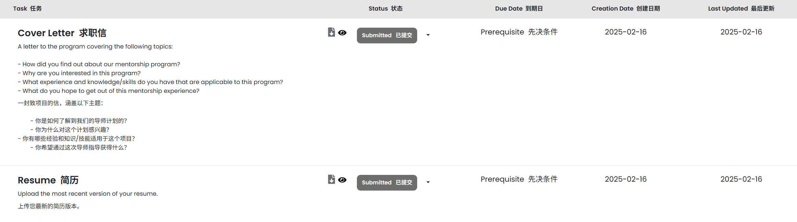

## 有关LFX报名和流程的总结

### 作者: [tiansuo114](https://github.com/tiansuo114)  2025/5/31

#### 杂谈

在2024年中旬,我参加了国内的[ospp(开源之夏)](https://summer-ospp.ac.cn/)开源活动,在这里我开始了我在[karmada社区](https://github.com/karmada-io)中的代码贡献,这份实习相当于我在与k8s相关的云原生开源项目的开始,参加这个项目的体验真的非常好😋

在这个过程中,我从与导师的交流中得到了一些指引,告知了我有关申请与进行[LFX mentorship 项目](https://mentorship.lfx.linuxfoundation.org/#projects_all)的相关信息,因为在ospp中社区内的交流环境和工作环境给我留下了非常好的印象,我便开始为LFX项目做准备

在ospp项目完成之后,我尝试为社区完成了几个pr,功利一些地说,这些是因为我想要保持我的名字存在在社区工作人员的视野中,这样可用有助于我在后面申请LFX实习项目时被选中(我个人认为这些和我在ospp项目中表现出来的还凑合的代码能力还有接近正常人的交流能力也是我能被最终选中的最大原因),故而最终我很幸运地得到了这份资格

#### 正文内容(有关LFX项目的申请和最终结项流程)

##### 前期准备

你需要注册一个LFX账号,有关这些内容的指引可以参考:[Mentees | Linux Foundation Documentation](https://docs.linuxfoundation.org/lfx/mentorship/mentees),这里面包含了大部分有关LFX项目的内容指引,并且会随着每一季度可能会出现的制度改变(例如类似ospp在2025年发生的"最大"的制度更新:取消了项目的导师津贴),该文档也会实时更新,所以参考它会是很好的选择

注册完成之后,需要在[Individual Dashboard | The Linux Foundation](https://openprofile.dev/edit/profile)中更新你的学校相关信息,并最好可以将你的github链接到你的LFX账户中

LFX项目的申请是和OSPP项目类似的,如果你有熟悉的社区的话,是最好的,在我曾经的求职过程中,我和一位经常在开源社区工作的面试管就我在karmada社区的贡献进行了交流,他对于这些开源项目的描述是:一般这些项目都是倾向于选择熟人

如果你没有相熟的社区,那我的推荐是首先通过LFX mentorship项目在github上维护的[季度项目文档](https://github.com/cncf/mentoring/tree/main/programs/lfx-mentorship)中寻找有没有自己喜欢的社区或者项目(当然也可以在LFX的官方网站上查看,但是我认为在文档中查看的效率更高)

待选定之后,首先填写一份较为宽泛的表格(大概就是为什么要申请这个项目,你的大概技术栈怎么样如如的内容,还有你的英文简历这些,我忘记截图了😭),这份表格按照你的信息正常填写即可,只要不是特别不正常一般不会对你的最终结果有影响

完成前期准备后,会进入到社区给你的前期任务阶段(在被选中承接项目前所需要进行的工作),不同社区的前期任务可能是不同的,我这里以我这次进行的任务为基准介绍

##### 前期任务

karmada社区的前期任务如下图所示

算是较为正常的任务,它并未要求你提供解题思路,但是最好还是附上自己的设计思路和对题目的理解内容,具体格式可以参考我附上的文档或者ospp项目中会提交的项目申请书(这个每个选上的人都会被在网站上公示,可用找来看)的内容

如果你的时间宽裕,也可以在提交终版文件之前与负责该项目的导师进行沟通,或者尝试参与社区的其他pr的制作,好感度和熟悉度高是可能你在代码能力外的最大优势

在完成这些之后,就是等了

接下来如果你被选中了,你只需要根据导师和邮件(有关签订合同,注册项目相关账号)的指引,按部就班完成任务即可,每个社区的内容均可能是不同的,所以具体内容就不再介绍了

##### 后期内容(有关津贴打款)

由于LFX项目不像ospp一样,有一些有关提交文档的工作流程,大部分的工作都不需要你完成,所以这里只写我认为可能对于中国学生有些帮助的打款内容

LFX项目的官方打款方式是通过[expensify](www.expensify.com)作为中间人,直接打款到你的银行卡中,这部分内容在你收到的邮件中都会有指引,如果你有来自香港或者国外的储蓄卡,应该不会出现我的问题,直接按照[教程](https://docs.linuxfoundation.org/lfx/mentorship/mentees/submit-a-report-to-receive-a-mentorship-stipend)就可以完成津贴流程

我遇到的问题主要是:可能是我的银行卡有一些问题,并不能直接收到来自expensify的打款,故而卡住了一段时间,最终是通过官方人员的帮助,通过bill.com来作为中间人的中间人,帮助完成了打款,如果你也有类似的需求,最好的方式是先和导师交流,寻求帮助

我在与我的导师交流之前尝试通过邮件向linux foundation的一些相关工作邮箱求助(events@linuxfoundation.org),但是最终结果并不太理想,在我与导师交流之后,我获知了我的项目的负责人邮箱(我并不知道这位是否同时负责其他项目,所以先不提供邮箱,请以你的导师指导为准),与他交流之后,我很快就在expensify报告中收到了相关信息的留言,并完成了收款流程

##### 总结

LFX项目对我来说,体验要比OSPP项目更加优秀(OSPP项目体验好的原因主要是因为我的导师和社区都很好,有关OSPP的进行流程我认为还有很多改进的空间),并且我认为这也是更加好的开源活动项目(注重学生能力培养,而非是否完成任务),完成相关任务对于喜欢敲代码,态度积极且愿意融入开源生活的新人来说,也并不是特别困难的,我希望更多的同学能够申请和尝试这些项目内容,此外,还有很多开源活动,并不需要把目光都集中在ospp项目上