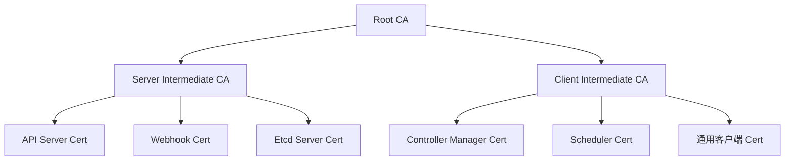
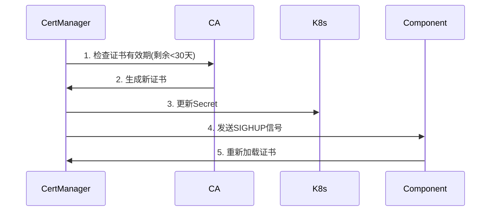

# Karmada 证书体系标准化设计文档

## 一、背景与目标

### 1.1 现状分析

- 当前问题：
  - 所有组件共享相同证书（CN=karmada）
  - 客户端/服务端证书未区分
  - 证书SANs配置不完整
- 风险点：
  - 身份混淆导致审计困难
  - 无法实现细粒度访问控制
  - 不符合PCI DSS等安全标准

### 1.2 设计目标

| 指标             | 当前状态 | 目标状态 |
| ---------------- | -------- | -------- |
| 服务端证书唯一性 | 0/8      | 8/8      |
| 客户端证书唯一性 | 0/11     | 11/11    |
| 证书自动轮换     | 不支持   | 支持     |
| 证书细粒度控制   | 无       | RBAC集成 |

## 二、架构设计

### 2.1 证书体系架构



### 2.2 核心组件关系

```go
// 证书签发流程（operator/pkg/certs/cert.go）
func IssueCertificate(cfg *CertConfig, caCert *x509.Certificate, caKey crypto.PrivateKey) (*TLSCert, error) {
    // 生成符合X.509 v3的证书
    certTemplate := &x509.Certificate{
        SerialNumber:          generateSerial(),
        Subject:               pkix.Name{CommonName: cfg.CN},
        NotBefore:             time.Now(),
        NotAfter:              time.Now().Add(cfg.Validity),
        ExtKeyUsage:           cfg.Usages,
        DNSNames:              cfg.SANs,
        BasicConstraintsValid: true,
    }
    // ...证书签名逻辑
}
```

## 三、详细设计

### 3.1 证书规范

#### 服务端证书

```yaml
# karmada-apiserver证书示例
CN: karmada-apiserver.karmada-system.svc
SANs:
  - karmada-apiserver
  - karmada-apiserver.karmada-system
  - 127.0.0.1
KeyUsage:
  - Digital Signature
  - Key Encipherment
ExtKeyUsage:
  - Server Auth
Validity: 8760h # 1年
```

#### 客户端证书

```yaml
# karmada-scheduler证书示例
CN: system:karmada-scheduler
KeyUsage:
  - Digital Signature
ExtKeyUsage:
  - Client Auth
Validity: 8760h
```

### 3.2 证书存储设计

```go
// 证书存储结构（operator/pkg/certs/store.go）
type CertStore struct {
    caCert     *TLSCert
    serverCerts map[string]*TLSCert // key=component name
    clientCerts map[string]*TLSCert
    mutex      sync.RWMutex
}

// Secret命名规则：
// - 服务端：<component>-tls (eg. karmada-apiserver-tls)
// - 客户端：<component>-client-tls (eg. karmada-scheduler-client-tls)
```

### 3.3 证书轮换策略



## 四、实施步骤

### 4.1 阶段规划

| 阶段              | 目标                   | 预计周期 |
| ----------------- | ---------------------- | -------- |
| 1. 服务端证书改造 | 完成8个服务端证书分离  | 2周      |
| 2. 客户端证书改造 | 完成11个客户端证书分离 | 2周      |
| 3. 证书存储改造   | 实现新版Secret存储结构 | 1周      |
| 4. 自动轮换机制   | 实现证书自动更新       | 3周      |

### 4.2 关键代码修改

```go
// 修改证书生成逻辑（operator/pkg/certs/cert.go）
func GetCertConfig(component string, certType CertType) *CertConfig {
    switch certType {
    case ServerCert:
        return &CertConfig{
            Name:   component + "-tls",
            CN:     fmt.Sprintf("%s.karmada-system.svc", component),
            SANs:   getServerSANs(component),
            Usages: []x509.ExtKeyUsage{x509.ExtKeyUsageServerAuth},
        }
    case ClientCert:
        return &CertConfig{
            Name:   component + "-client-tls",
            CN:     fmt.Sprintf("system:%s", component),
            Usages: []x509.ExtKeyUsage{x509.ExtKeyUsageClientAuth},
        }
    }
}
```

## 五、验证方案

### 5.1 功能验证

```bash
# 证书内容验证
openssl x509 -in karmada-apiserver-tls.crt -text -noout | grep -E 'CN|DNS:'

# 预期输出
Subject: CN = karmada-apiserver.karmada-system.svc
DNS:karmada-apiserver, DNS:karmada-apiserver.karmada-system.svc
```

### 5.2 安全验证

```go
// 客户端证书鉴权测试（test/e2e/cert_test.go）
func TestClientCertAuth(t *testing.T) {
    // 使用karmada-scheduler证书访问API
    config := rest.Config{
        Host:        apiserverURL,
        TLSClientConfig: rest.TLSClientConfig{
            CertFile: "karmada-scheduler-client-tls.crt",
            KeyFile:  "karmada-scheduler-client-tls.key",
        }
    }
    
    _, err := client.NewForConfig(&config)
    if err != nil {
        t.Fatalf("Authentication failed: %v", err)
    }
}
```

## 六、后续演进

1. **证书生命周期管理**：集成Vault等外部CA系统
2. **证书透明度日志**：实现证书签发审计
3. **mTLS增强**：组件间双向认证
4. **证书热更新**：不重启组件加载新证书

## 附录A：组件证书映射表

| 组件类型 | 组件名称          | 证书类型 | CN格式                         |
| -------- | ----------------- | -------- | ------------------------------ |
| 服务端   | karmada-apiserver | Server   | <component>.karmada-system.svc |
| 客户端   | karmada-scheduler | Client   | system:<component>             |