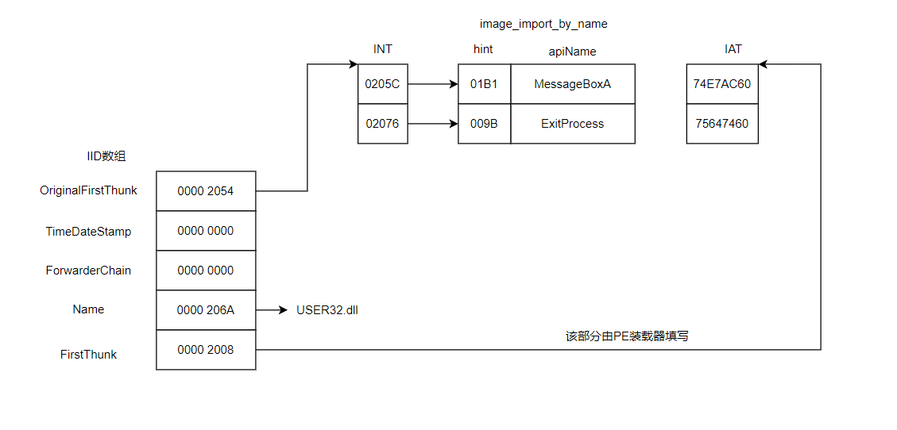
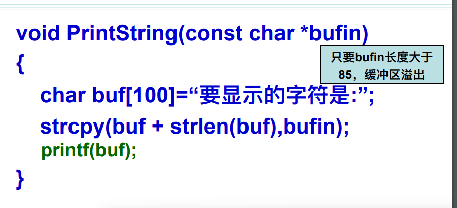
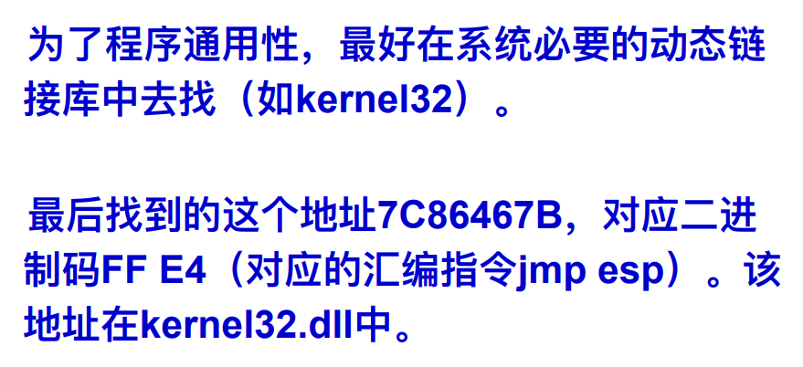

# 复习


😅

平时实验工具：PEview，010editor，ollyice，winhex，lordpe。


第一章：病毒基本概念 

病毒定义，病毒生命周期，病毒分类，病毒命名等


DOS引导型病毒：硬盘结构、**主引导扇区结构（MBR、分区信息、活动分区判定、结束标志）、DPT**、系统引导过程、**引导型病毒工作原理**、**与病毒相关的中断INT13H（如何清除掉引导型病毒）**、病毒程序如何常驻内存高端、引导型病毒的特点。**0413**


PE文件型病毒：**PE文件格式，如何判断一个文件是否是PE文件。**PE头部（Signature、FileHeader、OptionalHeader）、对齐粒度、RVA、FOA（这两个地址之间的转换）、节表、引入节和引出节（概念、如何定位等）、如何判定PE文件、**重定位技术、如何获取API函数地址（静态、动态（两个重要函数，这两个函数存放的位置、如何获得模块基地址、获得基地址后如何获取函数地址等 原理及代码是实现））、病毒如何感染PE文件（添加节、加长最后一个节、插入节；其中添加节方式作为重点）。**

 

蠕虫病毒：蠕虫的概念、**蠕虫与病毒的区别、栈溢出原理及代码（重点如何覆盖EIP，如何构造ShellCode）**、shellcode (payload)概念、构造、特点（不能使用特定字符）。

 

木马：木马概念、与普通病毒的区别、木马结构、木马数据传输通道

课程主要内容

## 一、试题类型

选择30分（每题2分）

判断分10（每题1分）

填空 20分(1空1分)

简答20分 （3题）

问答或程序填空20分 （2题-3题）


建议PPT+加教材结合复习

--------------（几个实验非常重要，需认真完成），大题与实验息息相关


## 二、基础知识

1949年，第一个勾勒出病毒程序蓝图的科学家：**冯诺依曼**

20世纪60年代初，“磁芯大战”，病毒的第一个雏形。


### 1、病毒的定义，分类，命名，生命周期，特性；

定义：计算机病毒是计算机程序中被嵌入的一组破坏计算机功能或毁坏数据，影响计算机使用，并能自我复制的计算机指令或者程序代码。


分类：

按操作系统：dos病毒（引导型，文件型，混合型），windows病毒（脚本，宏，pe，网页），unix病毒，其他平台

按破坏情况：良性病毒，恶性病毒

按传播媒介：单机病毒，网络病毒

按感染方式分类：感染可执行文件，感染引导区病毒，感染文档文件

按寄生方式和传染途径：引导型病毒，文件型病毒，引导兼文件型病毒（混合型病毒）

基本分类法：传统病毒，宏病毒，恶意脚本，木马程序，黑客程序，蠕虫程序。

 

生命周期：**潜伏阶段，传染阶段，触发阶段，发作阶段**

特性：**传播性**，隐蔽性，潜伏性，破坏性，非授权性，不可预见性，可触发性。


命名

蠕虫病毒：前缀为“Worm”，这种病毒通过网络或系统漏洞传播，具有发送带毒邮件、阻塞网络等特性‌。

木马病毒‌：前缀为“Trojan”，这种病毒潜伏在系统中，等待时机发动攻击‌。

宏病毒：前缀为“Macro”，主要感染具有编程宏能力的软件，如Word、Excel等‌。

脚本病毒：前缀为“Script”，利用脚本语言编写，通过网页进行传播‌。

系统病毒：前缀为“Win32”、“PE”、“Win95”、“W32”、“W95”等，主要感染Windows操作系统的.exe和.dll文件‌


### 2、病毒对抗技术的方式以及各自的特征；

1.特征码扫描：检测病毒特征值。

缺点：不能检测病毒变种或新型病毒。特征库越来越大。

2.启发式扫描：以特定方式实现的动态调试或静态反编译器，提取分析有关指令序列。

缺点：检测结果不准确。无法准确辨认病毒的名称和类别。

3.虚拟机技术：代码仿真，病毒在虚拟机中运行。

缺点：占用较多系统资源，影响系统性能。很难准确辨认病毒类别。开发投入较多。

4.主动防御技术：实时监控程序系统调用来确定其行为

5.自免疫技术：自校验与审计

 

### 计算机病毒的发展让传统的计算机病毒对抗技术暴露了以下不足：

1.主要针对本地系统进行防御

2.采取病毒特征匹配的方式进行查杀，而病毒库的更新是滞后于病毒传播的，使其无法查杀未知病毒

3.基于文件进行扫描的，无法适应对效率要求极高的网络查毒

4.病毒传播的数量达速度快，反病毒软件需要提高实时处理能力

 

### 病毒对抗技术，病毒三种机制

对抗技术

1未知病毒查杀技术2防病毒立体化体系3流扫描技术4云安全

 

病毒三种机制：**传播模块，触发模块，破坏模块**


## 三、PE病毒

### 0、重要术语

RVA:Relative Virtual Address,表示相对虚拟地址。它是相对内存中ImageBase的偏移位置.
VA:Virtual Address,表示虚拟地址，即装载到内存中之后的位置。

(VA=ImageBase+RVA)

举例说明，如果PE文件装入内存空间的400000处，且进程从虚拟地址401000h开始执行，我们可以说进程执行起始地址在RVA：1000h。

每个RVA都是相对于模块的起始VA的。


代码节的代码实际长度为0x46字节，文件中 节对齐粒度为0x200,丙存中节对齐粒度为0x1000字 节，请问代码节在文件和内存中分别占角多少字节？

- 文件中的代码节大小是0x200字节。
- 内存中的代码节大小（假设因为对齐而增加）是0x1000字节。


IAT（import address table）：导入地址表，在pe文件中，所有dll对应的导入地址数组在位置上是被排列在一起的，全部这些数组的组合被称为导入地址表。导入表中的一个`image_import_descriptor`的`FirstThunk`字段所指的地址就是IAT表的起始地址。（是一个`image_thunk_data`数组）


INT（import name table）：输入名称表，或称提示名表（hint-name table）。（是一个`iamge_thunk_data`数组）


IDT（import directory table）：输入目录表，每个DLL都使用一个元素，该列表中止于一个全0的数组元素。（是一个`image_import_descriptors`数组）


程序运行前


下图为第一个IID在磁盘文件里的结构


系统在程序初始化时根据`OriginalFirstThunk`的值找到函数名，调用`GetProcAddrress`或类似功能的函数，并根据函数名取得函数的入口地址，然后用函数入口地址取代`FirstThunk`指向的地址串中对应的值（IAT）。


PE文件加载后


下图第一个装载到内存里的IID的结构



程序装载到内存后，只与IAT表交换信息，输入表的其它部分就不需要了。


### 1、PE病毒的定义，常见的PE文件类型

PE病毒指Windows操作系统下，以PE文件为感染目标的病毒，有时也称为Win32病毒，属于文件型病毒的一种。

常见的PE文件类型包括：

- **.exe**：可执行文件，是Windows系统中最常见的PE文件类型，包含程序的可执行代码。
- **.dll**：动态链接库文件，也是PE文件的一种，它包含可以被多个程序同时使用的代码和数据。
- **.sys**：系统文件，通常用于Windows系统的内核模式，包含驱动程序等关键系统组件。
- **.com**：这是早期DOS系统中的可执行文件类型，但在Windows系统中仍然可以见到，不过相对较少。
- **.ocx**：对象链接与嵌入控件文件，通常用于在Windows应用程序中嵌入特定的功能或界面元素。

 

 

### 2、PE文件的判别

1. 首先，检查文件头部的前两个字节是否等于4D 5A (字符”MZ”的ASCII码)，如果是，则dos头有效。

2. 其次，使用DOS头中的e_lfanew字段来定位PE头的位置

3. 最后，检查PE头的前四个字节是否等50 45 00 00（即“PE\0\0”四个字符的ASCII码）

 

### 3、PE文件格式解析*

3、PE文件格式解析（标识的值及所在位置，dos头、dos hub、PE文件头、PE可选头、节表、数据目录等重要字段的值及其含义）；

PE文件整体结构


MZ Dos头

**Dos Stub删掉不影响程序执行。**

e_lfanew在0x3c偏移处


IMAGE_NT_HEADERS下：

映像文件头`IMAGE_FILE_HEADER`

```
WORD Machine; 该程序要执行的环境及平台
WORD NumberOfSections; 文件中节的个数
DWORD TimeDateStamp; 文件建立的时间
DWORD PointerToSymbolTable; COFF符号表的偏移
DWORD NumberOfSymbols;符号数目
WORD SizeOfOptionalHeader; 可选头的长度
WORD Characteristics; 文件属性标志集合
```


可选映像头`IMAGE_OPTIONAL_HEADER`

数据目录表以数组形式呈现，如下数据目录表的起始偏移为0x128，第一个import table RVA为0000 2010，第二个import table的RVA为0000 2024.(每个IDT结构大小0x14)。


 

节表，节名8字节


```
节属性，有的项相加
0x20 节有代码
0x40 节有初始化的数据
0x80 节有未初始化的数据
0x1000 0000 节可以共享
0x2000 0000 节可以执行
0x4000 0000 节可读
0x8000 0000 节可写

那么一个可读可写可执行且有初始化数据的节属性为：0xE000 0040
```


节表中的.text成员


节表中的.rdata成员


节表中的.data成员


 

“节（Section)”跟在节表之后，一般PE文件都有几个“节”。比较常见的有：

代码节 .text

已初始化的数据节 .data，存放**已初始化的全局变量，静态变量与常量**。

未初始化的数据节 .bbs，存放**未初始化的全局变量**，存放初始化为0的静态变量或全局变量。

引入函数节 .rdata


引出函数节 .edata


资源节 .rsrc


### 4、导入（引入）表、导出（引出）表的定位以及解析


#### 一、导入表（Import Table）

1. **定位**：
   - 导入表位于PE文件的数据目录项中，通过可选PE头中的`DataDirectory[IMAGE_DIRECTORY_ENTRY_IMPORT]`字段可以定位到导入表。
   - 该字段包含导入表的虚拟地址（RVA）和大小。
   - 在文件中解析时，需要将RVA转换为文件偏移地址（FOA），然后加上当前文件的首地址即可定位到导入表。
2. **结构**：
   - 导入表的主要结构是`IMAGE_IMPORT_DESCRIPTOR`，它包含多个成员，如`Characteristics`、`TimeDateStamp`、`ForwarderChain`、`Name`、`OriginalFirstThunk`和`FirstThunk`等。
   - `Name`成员指向以`\0`结尾的ANSI字符串，表示导入的DLL文件名。
   - `OriginalFirstThunk`和`FirstThunk`成员分别指向导入名称表（INT）和导入地址表（IAT）的地址。
3. **解析**：
   - 通过遍历`IMAGE_IMPORT_DESCRIPTOR`结构数组，可以获取所有导入的DLL文件名。
   - 对于每个DLL，通过`OriginalFirstThunk`成员可以定位到导入名称表（INT），该表包含了一系列指向`IMAGE_IMPORT_BY_NAME`结构的指针，每个结构包含一个导出序号（可选）和一个以`\0`结尾的函数名。
   - `FirstThunk`成员指向导入地址表（IAT），在程序运行前，IAT与INT结构相同；程序运行时，Windows加载器会将IAT中的每个条目填充为对应函数在DLL中的实际地址。

#### 二、导出表（Export Table）

1. **定位**：
   - 导出表也位于PE文件的数据目录项中，通过可选PE头中的`DataDirectory[IMAGE_DIRECTORY_ENTRY_EXPORT]`字段可以定位到导出表。
   - 同样，该字段包含导出表的虚拟地址（RVA）和大小。
2. **结构**：
   - 导出表的主要结构是`IMAGE_EXPORT_DIRECTORY`，它包含多个成员，如`Characteristics`、`TimeDateStamp`、`MajorVersion`、`MinorVersion`、`Name`、`Base`、`NumberOfFunctions`、`NumberOfNames`、`AddressOfFunctions`、`AddressOfNames`和`AddressOfNameOrdinals`等。
   - `Name`成员指向导出表的文件名字符串的RVA。
   - `AddressOfFunctions`成员指向导出函数地址表的RVA。
   - `AddressOfNames`成员指向导出函数名称表的RVA。
   - `AddressOfNameOrdinals`成员指向导出函数序号表的RVA。
3. **解析**：
   - 通过`Name`成员可以获取导出表的文件名（通常是DLL文件名）。
   - `AddressOfFunctions`成员指向的函数地址表包含了所有导出函数的地址（RVA或VA）。
   - `AddressOfNames`成员指向的函数名称表包含了所有以函数名导出的函数的名称字符串的RVA。
   - `AddressOfNameOrdinals`成员指向的序号表与名称表相对应，存储了每个导出函数在地址表中的索引（序号）。
   - 通过遍历名称表和序号表，可以获取所有导出函数的名称和地址。


### 5、RVA到FOA的转换过程

1. **RVA（相对虚拟地址）**：是PE文件被装载到虚拟内存后相对于基址（ImageBase）的偏移地址。RVA在程序加载到内存时被使用，它指向程序在内存中的虚拟地址。
2. **FOA（文件偏移地址）**：是PE文件在磁盘上存放时相对于文件开头的偏移地址。FOA在程序未加载到内存时被使用，它指向程序在磁盘上的文件偏移量。

查看节表，每个节表项都包含了节的虚拟地址（VirtualAddress）、在文件中的偏移地址（PointerToRawData）、节的大小（SizeOfRawData）等。

FOA = PointerToRawData + (RVA - VirtualAddress)

注意上面的VirtualAddress的含义。


### 6、往PE文件中插入病毒代码的3种主要方式

6、往PE文件中插入病毒代码的3种主要方式，掌握每种方式的过程以及对重要字段的修改；

答：**添加节**、加长最后一个节、插入节

看实验报告中添加节部分

#### 一、添加节方式

添加节方式是在PE文件的节表（Section Table）中添加一个新的节条目，并在文件的末尾为该节分配空间。这种方式允许病毒代码作为一个独立的节存在，便于管理和执行。

过程：

1. 先把病毒代码追加到文件尾部。

2. 在节表中增加一个section header各项数据填写正确(VirtualSize,VirtualAddress,PointerToRawData.....)

3. 在FILEHEADER中修改节表项数目：+1。

4. 重新计算SizeofHeaders,并替换原值。

5. 重新计算Sizeoflmage,并替换原值。

6. 记录未感染时的AOEP（入口地址)，因为在病毒代码结束时要让宿主程序正常执行。所以要先记录AOEP，在病毒程序结束后JMP跳到宿主程序的AOEP。

7. 修改OptionalHEADER中的AddressOfEntryPoint,让它指向新加节的入口代码

#### 二、加长最后一个节方式

加长最后一个节方式是通过扩展PE文件中最后一个节的大小来容纳病毒代码。这种方式**不需要修改节表条目数**，但可能需要调整最后一个节的文件偏移和虚拟大小。


过程：

1. 先把病毒代码追加到最后一个节的尾部。
2. 修改节表中最后一项section header并增加SizeOfRawData的大小和内存布局大小。

3. 记录原可选头的AOEP，病毒代码的末尾跳转到原AOEP处。
4. 修改可选头的AOEP指向病毒代码入口处。

#### 三、插入节方式*

这种方式**不增加节的个数和文件长度**，病毒搜寻到一个可执行文件后，分析每个节，查询节的空白空间是否可以容纳病毒代码，若可以，则感染之。CIH病毒就是采用这种方法感染可执行文件的。


SizeOfRawData-VirtualSize

过程：

1. 找到节间隙：遍历PE文件的节表，找到足够大的节间隙以容纳病毒代码。
2. 写入病毒代码：将病毒代码写入节间隙中。
3. 更新节表和重要字段：修改节名，节表结构中的SizeOfRawData。
4. 记录原可选头的AOEP，病毒代码的末尾跳转到原AOEP处。
5. 修改可选头的AOEP指向病毒代码入口处。


### 7、病毒代码运行过程中需要解决的问题(获取基地址)

了解就行

7、病毒代码运行过程中需要解决的问题（需要自身动态获取要加载的模块以及模块中函数的地址，问题转换为要去动态寻找loadlibrary函数所在模块的基址，掌握获取该基址的4种方式的原理）；


1.

由于程序入口点是被kernel.32某个函数调用的，所以这个调用函数肯定在kernel32的地址空间上。

那么我们只要取得这个返回地址，就得到了一个kernel.32空间中的一个地址。

通过这个地址，我们可以从高地址向低地址方向进行搜索，通过PE标志的判断，搜索到kernel.32模块的基地址！

```assembly
GetKBase:
	mov edi ,[esp]
	;取栈顶值，就是KERNEL32中的一个地址
	and edi,0FFFFF000h
	;分配粒度是1000h,基地址必然在xxxx000h处
	.while TRUE
		.if WORD ptr [edi]==IMAGE_DOS_SIGNATURE
		;判断DOS头标志
			mov esi,edi
			add esi,DWORD ptr [esi+03Ch];B+e_lfanew
			;es指向PE标志
			.if DWORD ptr [esi]==IMAGE_NT_SIGNATURE;判断PE标志"PE\0\0"
				.break
				;若正确，则跳出循环
			.endif
		.endif
		sub edi,01000h
	.endw
mov hKernel32,edi;把找到的KERNEL32.DLL的基地址保存起来
```


2.通过宿主进程的PEB：进程环境块获得

Fs寄存器>TEB
**TEB +0x30->PEB**
`PEB +0x0c->PEB_LDR_DATA`
`PEB_LDR_DATA+0x1c`处存放了一些DLL的地址，第一个是nt.dll地址，第二个就是kernel32.dll的地址了。

3.SEH(结构化异常处理)

SEH链表中最顶层的异常处理函数是Kernel32.dll中的一个函数。

可以遍历这个链表去搜索这个函数地址，通过这个函数地址向低地址方向以64KB为对齐单位查找PE文件的DOS头标志”MZ”,从而找到Kerne32.dll的地址


4.宿主进程中的TEB:

线程环境块，这个块存放了线程的栈顶地址，这个地址+0x1c肯定位于kernel32.dl中(NT系统)。


### 8、重定位的原理以及代码实现*

**重定位原因**：

1. 病毒代码运行时内存地址不可预知。
2. 确保引用数据的地址正确，避免错误。


```assembly
.code
	call @f 
	@@: pop ebx ;取出call返回地址，实际是本行地址
	sub ebx,offset @B ;ebx减去上一行偏移量就是基地址
	jmp @f
	x dd 12345678h
	@@: mov eax,[ebx+x]
```

@@，在汇编语言中，是当作标号用的。

@F，就是向下转移到最近的 @@ 处；
@B，就是向上转移到最近的 @@ 处。

### 9、动态获取API函数地址的原理以及代码实现*

**动态获取API地址原因**：

1. 病毒只有代码节，无引入函数节。
2. 需要在运行时确定API函数在DLL中的地址。

如何获取api函数地址：静态，动态（两个重要函数，这两个函数存放的位置、如何获得模块基地址、获得基地址后如何获取函数地址等 原理及代码是实现）

静态方式：调用时，根据函数名查引入表，就可以获取该函数的地址
动态方式：使用函数LoadLibrary装载需要调用的函数所在的dll文件，获取模块句柄。然后调用GetProcAddress获取需要调用的函数地址。这种方式是在需要调用函数时才将函数所在的模块调入到内存中同时也不需要编译器为函数在引入表中建立相应的项。

LoadLibrary 加载一个DLL,返回DLL地址
GetProcAddress 通过DLL地址和API函数名获得API函数的地址

C语言实例：
DLL地址=LoadLibrary("DLL名");
API函数地址=GetProcAddress(DLL地址，"函数名");


```assembly
.586p
.model flat,stdcall
option casemap:none;
include    include\windows.inc
include    include\kernel32.inc
includelib lib\kernel32.lib
include    include\user32.inc
includelib lib\user32.lib

GetApiAddress PROTO:DWORD,:DWORD

.data
    Kernel32Addr dd ?
         ExportKernel dd ?
    GetProcAddr dd ?
         LoadLibraryAddr dd ?
    msgAddr dd ?
    xingming db "蔡徐坤",0
    xuehao db "1145141919",0
    aGetProcAddr db "GetProcAddress", 0 
         GetProcAddLen equ  $-aGetProcAddr-1
    aLoadLibrary db "LoadLibraryA" , 0
         LoadLibraryLen equ $-aLoadLibrary-1 ; LoadLibraryA字符串长度
    strMessageBoxA db "MessageBoxA",0
    strUser32  db "User32.dll",0
    strShow    db "动态messagebox演示",0
    szTitle db "检测结果", 0
    temp1 db "Kernel32.dll 基本地址：%8x" , 0dh , 0ah
    db       "LoadLibrary 地址：     %8x" ,0dh, 0ah
    db       "GetProcAddress 地址：  %8x" , 0dh , 0ah , 0
    temp2 db 0 dup(100)
    
    

.code
main:
Start:
       mov  esi, [esp] ;取栈顶值，就是KERNEL32中的一个地址
       and  esi,0fffff000h ;分配粒度是1000h，基地址必然在xxxx000h处
LoopFindKernel32:
       sub  esi,1000h
       cmp  word ptr [esi], IMAGE_DOS_SIGNATURE ;判断DOS头标志
       jnz  short LoopFindKernel32 
GetPeHeader:
       mov edi,dword ptr[esi+03Ch] ;esi指向PE标志
       add edi, esi 
       cmp word ptr [edi], IMAGE_NT_SIGNATURE ;判断PE标志
       jnz short LoopFindKernel32 ;若正确，则跳出循环
     mov Kernel32Addr,esi ; 把找到的KERNEL32.DLL的基地址保存起来
     invoke GetApiAddress,Kernel32Addr,addr aLoadLibrary
     mov LoadLibraryAddr,eax
     invoke GetApiAddress , Kernel32Addr, addr aGetProcAddr
     mov GetProcAddr , eax
     ; 使用wsprintf格式化输出信息
     invoke wsprintf,addr temp2,addr temp1,Kernel32Addr,LoadLibraryAddr,GetProcAddr
     invoke MessageBoxA,0,addr temp2,addr szTitle,0

     ; 加载User32.dll并获取MessageBoxA的地址
     push offset strUser32
     call LoadLibraryAddr
     push offset strMessageBoxA
     push eax
     call GetProcAddr
     mov msgAddr,eax
     ; 准备MessageBoxA的参数并调用
     push 0
     push offset xingming
     push offset xuehao
     push 0
     call msgAddr 

     invoke ExitProcess,0
         
         

GetApiAddress proc uses ecx ebx edx esi edi hModule:DWORD ,szApiName:DWORD
   LOCAL dwReturn:DWORD
   LOCAL dwApiLength:DWORD
   mov dwReturn,0
   mov esi,szApiName ; 将API名称的指针保存到ESI寄存器
   mov edx,esi ; 将ESI的值（API名称的指针）复制到EDX，用于后续计算长度
   
 ; 查找API名称字符串的结束符（null字符）
 Continue_Searching_Null:
   cmp byte ptr[esi],0 ; 比较当前字符是否为0
   jz  We_Got_The_Length
   inc esi ;移动到下个字符
   jmp Continue_Searching_Null
 We_Got_The_Length:
   inc esi ;跳过null字符
   sub esi,edx ; 计算API名称的长度（ESI现在指向null字符后，EDX指向起始位置）
   mov dwApiLength ,esi ; 将长度保存到dwApiLength
   
   ; 获取模块的导出表地址
   mov esi,hModule
   add esi,[esi+3ch] ; ESI现在指向PE头的地址（3Ch是PE头相对于DOS头的偏移）
   assume esi:ptr IMAGE_NT_HEADERS
   mov esi,[esi].OptionalHeader.DataDirectory.VirtualAddress ; 获取导出表的虚拟地址
   add esi,hModule ; 加上模块基地址，得到导出表的实际地址
   assume esi:ptr IMAGE_EXPORT_DIRECTORY 

   ; 遍历导出表中的函数名称
   mov ebx,[esi].AddressOfNames ; 获取函数名称数组的指针
   add ebx,hModule ; 加上模块基地址
   xor edx,edx ; 清零EDX，用于计数
   .repeat
      push esi ; 保存当前导出表指针
      mov edi,[ebx] ; 获取当前函数名称的指针
      add edi,hModule ; 加上模块基地址
      mov esi,szApiName ; 重置ESI到API名称的起始位置
      mov ecx,dwApiLength ; 设置ECX为API名称的长度
      cld ; 清除方向标志，设置字符串操作为正向
      repz cmpsb  ; 比较字符串，直到找到不匹配或ECX为0
      .if ZERO? ; 如果字符串相等（即找到了匹配的函数名称）
          pop esi ; 跳转到查找函数索引的代码
          jmp _Find_Index
      .endif
      pop esi ; 恢复导出表指针
      add ebx,4 ; 移动到下一个函数名称的指针
      inc edx ; 增加计数器
      .until edx >= [esi].NumberOfNames ; 直到遍历完所有函数名称
      jmp _Exit  ; 如果没有找到，跳转到退出代码
      
      _Find_Index:
      ; 根据找到的函数名称索引，找到对应的函数序号
         sub ebx,[esi].AddressOfNames ; 计算函数名称在数组中的偏移
         sub ebx,hModule ; 转换为相对于模块基地址的偏移
         shr ebx,1 ; 因为每个指针是4字节，所以除以2得到索引
         add ebx, [esi].AddressOfNameOrdinals ; 加上序号数组的起始地址偏移
         
         add ebx,hModule ; 加上模块基地址
         movzx eax,word ptr [ebx]  ; 获取函数序号
         shl eax,2 ; 序号乘以4（因为函数地址数组中的每个地址是4字节）
         add eax,[esi].AddressOfFunctions ; 加上函数地址数组的起始地址偏移
         add eax,hModule ; 加上模块基地址
         
         mov eax,[eax] ; 获取函数地址（可能是重定位表索引或实际地址）
         add eax,hModule ; 如果是重定位表索引，则加上模块基地址得到实际地址
         mov dwReturn,eax ; 将函数地址保存到dwReturn
        _Exit:
         mov eax,dwReturn ;将函数地址设置为返回值
         ret
       GetApiAddress    endp
       end main
```


### 10、GetProcAddress函数的汇编代码实现过程

不重要

10、熟练掌握实验中（PPT中），GetProcAddress函数的汇编代码实现过程；


### 11、寻找ExitProcess函数地址

首先从AddressOfNames:指向的指针数组中找到"ExitProcess"字符串，并记下该数组序号x

然后从AddressofNameOrinals指向的数组中，定位第x项成员，得到一个序号y

y为ExitProcessg函数地址在AddressOfFunctions中的索引号

从AddressOfFunction:指向的数组中定位第y项，获得ExitProcess的RVA函数地址


## 四、引导型病毒

### 硬盘结构

CHS
Cylinder [ˈsɪlɪndə(r)] 柱面数，每面盘片几条磁道，max 1023
Head(磁头数)，有几面盘片，max 255
Sector(扇区数)，每条磁道几个扇区，max 63

每个扇区一般512字节

外圈磁道扇区比内圈的多。

主引导扇区位于硬盘0面0柱1扇区，它是硬盘上的第一物理扇区。由**主引导程序**(446字节)以及**分区表**组成。最后 55 AA 为结束标记。


### 1、引导型病毒的定义和特点

定义：**引导型病毒**‌是指寄生在磁盘引导区或主引导区的计算机病毒。这种病毒通常将自己的程序代码嵌入到软磁盘的引导区或硬盘的主引导记录区，当计算机启动时，病毒会被首先加载到内存中，从而感染硬盘和其他软盘‌

特点：

1.引导型病毒式在操作系统之前进入内存，寄生对象又相对固定，因此该类型病毒基本上不得不采用减少操作系统所掌管的内存容量方法来驻留内存高端。而正常的系统引导过程一般是不减少系统内存的。

2.引导型病毒需要把病毒传染给软盘，一般是通过修改INT 13H的中断向量，而新的INT 13H中断向量地址必定指向内存高端的病毒程序。

3.引导型病毒感染硬盘时，必定驻留硬盘的主引导扇区或引导扇区，并且只驻留一次，因此引导型病毒一般都是在软盘启动过程中把病毒传染给硬盘的。而正常的引导过程一般是不对硬盘主引导扇区进行写盘操作的。

4.引导型病毒的寄生对象相对固定，把当前的系统主引导扇区和引导扇区与干净的主引导扇区和引导扇区进行比较，如果内容不一致，可认定系统引导区异常。


### 2、CHS方式访存的原理以及缺陷

原理：在CHS方式下，硬盘读写数据时，首先根据柱面号定位到相应的磁道组，然后根据磁头号选择具体的盘面和磁道，最后根据扇区号定位到磁道上的具体扇区进行数据的读写操作。

缺陷：

1. **容量限制**：由于CHS方式使用固定的柱面数、磁头数和扇区数来表示硬盘的容量，因此当硬盘容量增大时，这种方式就无法满足需求。特别是当硬盘容量超过8GB时，CHS方式就无法准确表示所有的扇区位置。
2. **寻址效率较低**：CHS方式需要分别定位柱面、磁头和扇区，这个过程相对复杂且耗时。特别是在需要访问大量数据时，CHS方式的寻址效率会成为硬盘性能的一个瓶颈。
3. **不利于硬盘的扩展和升级**：随着硬盘技术的不断进步，硬盘的容量和性能都在不断提升。然而，CHS方式由于其固有的缺陷，无法很好地适应这种变化。因此，在硬盘的扩展和升级方面，CHS方式也显得力不从心。


### 3、莫里斯病毒、振荡波病毒、CIH病毒、大麻病毒的主要特点

莫里斯病毒（Morris Worm）

- **类型**：蠕虫病毒。
- **编写者**：罗伯特·泰潘·莫里斯。
- **爆发时间**：1988年。
- **利用系统**：Unix系统。
- **主要特点**：
  - **是通过互联网传播的第一种蠕虫病毒，也是第一次得到主流媒体的强烈关注的电脑病毒事件**。
  - 利用了Unix系统中sendmail、Finger、rsh/rexec等程序的已知漏洞以及薄弱的密码。
  - 蠕虫代码中一段非本意的效果（unintended consequence）加剧了其危害性，使同一台计算机会被重复感染，每次感染都会造成计算机运行变慢直至无法使用。
  - 对当时的互联网造成了毁灭性影响，包括系统长时间宕机，也包括担忧互联网的安全性、可靠性的心理冲击。

振荡波病毒

- **主要特点**：
  - 在网络上自动搜索系统有漏洞的计算机，并直接引导这些计算机下载病毒文件并执行，因此整个传播和发作过程不需要人为干预。
  - 发作特点类似于“冲击波”病毒，会通过FTP的5554端口攻击计算机，使系统文件崩溃，造成计算机反复重启。
  - 病毒如果攻击成功，会在C:\WINDOWS目录下产生名为avserve.exe的病毒体。
  - 会随机扫描IP地址，对存在漏洞的计算机进行攻击，并会打开FTP的5554端口，用来上传病毒文件。
  - 会使“安全认证子系统”进程LSASS.exe崩溃，出现系统反复重启的现象，并使与安全认证有关的程序出现严重运行错误。

CIH病毒

- **类型**：文件型病毒，恶性病毒。
- **产自**：中国台湾。
- **制作者**：原集嘉通讯公司（技嘉子公司）手机研发中心主任工程师陈盈豪。
- **主要特点**：
  - 能够破坏计算机系统硬件。
  - 最早随国际两大盗版集团贩卖的盗版光盘在欧美等地广泛传播，随后进一步通过网络传播到全世界。
  - 病毒发作后，硬盘数据全部丢失，甚至主板上BIOS中的原内容也会被彻底破坏，主机无法启动。

大麻病毒（Marijuana Virus）

- **别名**：新西兰病毒。
- **发现时间**：1988年初。
- **主要特点**：
  - 名字来源于该病毒体内的一段信息。
  - 早期只感染360KB的软盘，不感染硬盘。后来的变种大部分感染硬盘，有的会改动显示信息。
  - 病毒程序短小，总共不到400个字节的代码就完成驻留内存、修改中断向量、区别软硬盘、感染软盘、感染硬盘、引导原硬盘主引导扇区、显示时机判断、显示信息以及大麻病毒感染标志判断以防止重复感染等众多功能。
  - 对于不同类型的磁盘，大麻病毒侵占的扇区和将原磁盘引导扇区转移的目标扇区都有所不同。
  - 程序本身没有刻意编写的破坏代码，但能引起数据混乱、文件丢失等。


### 4、主引导扇区的结构、MBR代码的主要功能；

主引导扇区结构（MBR、分区信息、活动分区判定、结束标志）

MBR446字节，DPT64字节


### 5、DPT表的数据解析（每个分区表项16字节的含义）*


### 6、引导型病毒的工作环境、工作原理；

工作原理：引导型病毒是一种在ROM BIOS之后，系统引导时出现的病毒，它先于操作系统，依托的环境是**BIOS中断服务程序**。引导型病毒是利用操作系统的引导模块放在某个固定的位置，并且控制权的转交方式是以物理位置为依据而不是以操作系统引导区的内容为依据，因而病毒占据该物理位置即可获得控制权，而将真正的引导区内容搬家转移或替换，待病毒程序执行后，将控制权交给真正的引导区内容，使得这个带病毒的系统看似正常运转，而病毒已隐藏在系统中并伺机传染、发作。

主要技术手段：**常驻内存高端**。修改中断向量表，截获系统中断。

### 7、系统的正常启动过程以及感染了引导型病毒之后的启动过程；

(1)BIOS加电自检(POST)，此时电源稳定后，CPU从内存**FFFF:0000**处开始执行。
(2)将硬盘第一个扇区读入内存地址0000:7C00处。

(3)检查**0000:7dfe**是否等于**0xaa55**,若不等于则转去尝试其他启动介质。
(4)跳转到0000:7C00处执行MBR中的程序。
(5)MBR首先将自身重定位到0000:0600处，然后继续执行。
(6)在主分区表中搜索标志为活动的分区。

(7)将活动分区的第一个扇区读入内存地址0000:7C00处。
(8)跳转到0000:7C00处继续执行特定的系统启动程序。


### 8、病毒相关的中断INT13H（如何清除掉引导型病毒）*

病毒相关的中断INT13H（如何清除掉引导型病毒）


```assembly
mov ax,0201
mov bx,0200
mov cx,0007
mov dx,0080
int 13h
;读磁盘0面0道7扇区的内容到0020

mov ax,0301
mov bx,0200
mov cx,0001
mov dx,0080
int 13h
;把该内容写回主引导扇区，清除掉病毒
```


### 9、实模式下1M内存的组成

8086cpu实模式最大可寻址1MB内存空间

在x86架构的实模式中，CPU可以访问的总内存地址范围是0x00000到0xFFFFF，即1MB。这个地址范围被称为实模式内存空间或常规内存。

0x00000到0x9FFFF‌：这部分内存对应动态随机访问内存（DRAM），即我们通常所说的物理内存条。这部分内存用于存储操作系统和应用程序的数据‌。

0xF0000到0xFFFFF‌：这部分内存用于存放BIOS（基本输入输出系统）的代码和数据。BIOS的主要作用是检测和初始化硬件，并建立中断向量表‌。

在DOS实模式下，记录基本内存大小的容量标志单元的偏移是：**0000:0413h**

### 10、病毒程序如何常驻内存高端

想办法把病毒程序载入到内存中，载入后保证这一段代码不被其他代码覆盖

内存**0000：0413**处两字节描述了基本内存的大小，它的值是KB的倍数。


如何常驻内存高端？

1.病毒程序首先将自身复制到内存的高端，修改内存容量标志单元，在原有值的基础上减去病毒长度，使得病毒代码能多常驻内存；

2.然后将原int13h磁盘中断服务程序的中断向量保存，并修改此中断向量，将其指向病毒代码，病毒代码因此获得系统控制权，进而执行感染、破坏等工作。


## 五、蠕虫病毒

### 1、蠕虫病毒的概述，与病毒的区别


### 2、栈溢出原理及代码

如何覆盖EIP，如何构造shellcode

栈是一种后进先出的数据结构，程序中的局部变量、函数调用信息（如返回地址、参数、保存的寄存器值等）都存储在栈中。当程序向栈中写入的数据量超过了栈的剩余空间，就会导致栈溢出。最经典的栈溢出利用方式是覆盖函数的返回地址，以达到劫持程序控制流的目的。

代码懂的都懂。

要会画栈帧图


### 3、shellcode概念，构造，特点（不能使用特定字符）

Shellcode是指能完成特殊任务的自包含的二进制代码，根据不同的任务可能是发出一条系统调用或建立一个高权限的Shell，Shellcode因此得名。
最终目的：获取目标机器的控制权


```assembly
Push 646170
Push 65746f6e
Push 1
Mov eax,esp
Add eax,4
Push eax

Mov eax,WinExec
Call eax
Push 0
Mov eax,ExitProcess
Call eax
```


特点：

1.长度受限
2.**不能使用特殊字符，例如x00、xf等**
3.具有重定位能力
4.一定的兼容性


### 4、32位cdecl调用约定的特点

传参的方式是堆栈传参、传参的顺序是从右到左、堆栈平衡（清理）工作由父函数（调用者）来完成；

函数的返回值通常保存在EAX寄存器中（对于整数类型）。对于浮点型结果，返回值则存放在ST0寄存器中。

注意与fastcall区分。

### 5、结合PPT上的“打开记事本”例子：熟练掌握缓冲区溢出的原理，会画函数栈帧的图*

缓冲区溢出基本原理：当程序向缓冲区写入的数据超过其容量时，会导致数据溢出到相邻的内存区域，从而破坏程序的堆栈或覆盖其他重要数据，使程序崩溃或执行恶意代码。





### 6、payload（填充区域、覆盖返回地址、shellcode）的组成以及各部分主要关注的问题，PPT上加强shellcode通用性的代码原理；





## 六、木马

### 1、文件型病毒与蠕虫病毒的区别

**文件型病毒**：

1. 通过操作系统中的文件系统进行感染，主要感染计算机中的可执行文件。
2. 依赖宿主文件传播。
3. 破坏或篡改受感染文件。
4. 传播速度和破坏性相对有限。

**蠕虫病毒**：

1. 不依赖宿主文件，自我复制传播。
2. 传染目标是互联网内的所有计算机。
3. 利用系统漏洞、邮件等快速传播。
4. 具有更大的传染性和破坏性。


### 2、木马的概念，组成、入侵过程、自启动的方式、建立隐蔽通道的方式；

木马是一种恶意软件，它通常伪装成合法的软件或程序，诱骗用户下载并执行，从而在用户的计算机系统中潜伏并执行恶意操作，如窃取信息、破坏数据等。

木马软件一般由**木马配置程序、控制端程序和被控端程序**三部分组成

木马的主要能力是**信息收集能力**。

入侵过程：配置木马，**传播木马，运行木马，泄露信息**，建立连接，远程控制。


自启动方式：

1.捆绑应用程序，dll劫持
2.修改系统注册表的各种启动项（常用）
3.注册为一个系统服务
4.应用程序启动组
5.修改文件关联

6.重定位技术

没有**远程进程调用**


建立隐蔽信道的方式：

1. **端口寄生**：木马寄生在系统中已经打开的通信端口上，如TCP 80端口，平时只是监听此端口，遇到特殊指令才进行解释执行。
2. **反弹端口**：木马不主动打开端口等待连接，而是由控制端主动连接服务端的某个高端口。这种方式可以绕过防火墙的监控。
3. **使用加密通信(通信隐藏)**：木马与控制端之间的通信数据进行加密处理，以防止被截获和分析。
4. **隐藏进程和服务**：木马通过修改系统进程列表和服务列表来隐藏自身的进程和服务，从而避免被用户或安全软件发现。
5. 使用报文伪装技术建立秘密信道：将数据插入到HTTP协议报文的一些无用的段内，然后利用建立TCP连接的三次握手规则进行秘密通信。或者在ICMP包中的选项数据中插入数据。


### 3、木马通常具备的功能，木马查找的主要工具；


 木马通常具备以下功能：

1. 管理远程文件：对被控主机的系统资源进行管理，如复制、删除、查看文件，以及上传/下载文件等。
2. 打开未授权的服务：为远程计算机安装常用的网络服务，使其为黑客或其他非法用户服务。例如，被木马设定为FTP文件服务器后的计算机，可以提供FTP文件传输服务、为客户端打开文件共享服务等。
3. 监视远程屏幕：实时截取屏幕图像，并将截取到的图像另存为图片文件，实时监视远程用户目前正在进行的操作。
4. **控制远程计算机**：通过命令或远程监视窗口直接控制远程计算机，例如控制远程计算机执行程序、打开文件或向其他计算机发动攻击等。（主要）
5. 窃取数据：以窃取数据为目的，本身不破坏计算机的文件和数据，不妨碍系统的正常工作。木马以系统使用者很难察觉的方式向外传送数据，典型代表为键盘和鼠标操作记录型木马。


木马常用技术：通信隐藏，远程线程注入，攻击杀毒软件，穿透防火墙，Rootkit技术等。


工具

1. 360安全卫士
2. 火绒
3. 金山毒霸
4. 腾讯电脑管家
5. 2345安全卫士

