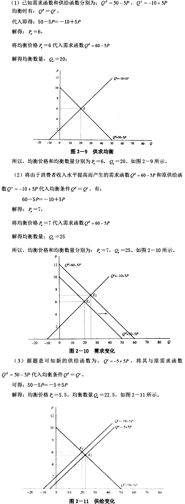
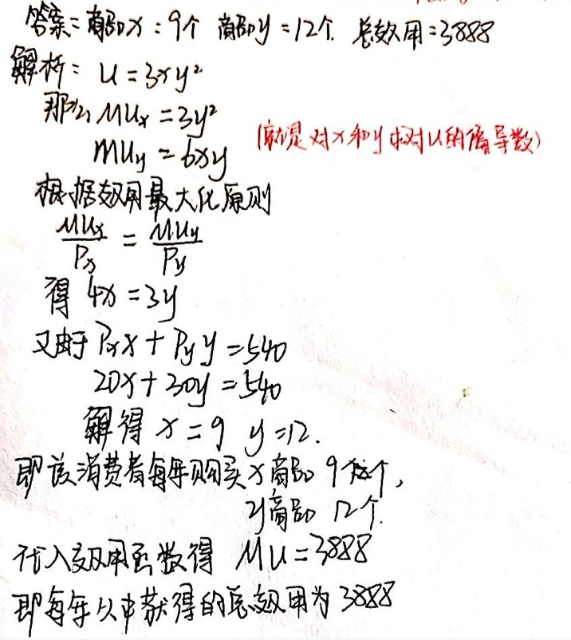
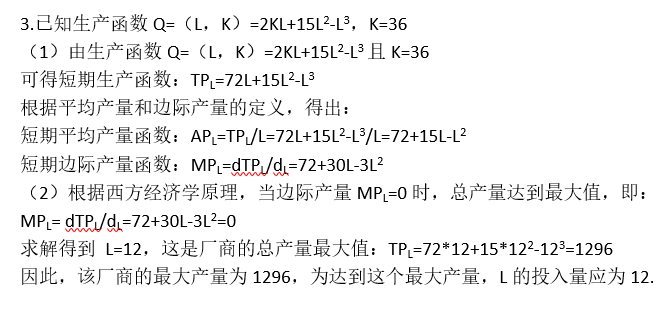
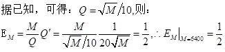

# 西方经济学 复习资料

- **选择题**
    - 一
        - 以下不是直接影响需求的因素或条件是**成本**
        - 市场均衡意味着 **上述答案均正确**
        - 如果X与Y商品是互补品，X价格下降，将使Y**需求增加**
        - 若一种商品的消费量随着消费者收入的增加而减少，一般来说，该商品是**劣质品**
        - 消费者预算线发生平移时，连接消费者均衡点的曲线称为**收入—消费曲线**
        - 假如一个完全竞争厂商接到订单价格小于平均成本但大于平均可变成本，它就应是**亏损但继续生产**
        - 如果价格下降10%能使买者总支出增加10%，则这种商品的需求量对价格**富有弹性**
        - 使用50个单位的劳动，一个厂商能够生产出1800单位的产量；使用60个单位的劳动，一个厂商能够生产出2100单位的产量。额外一单位劳动的边际产量是**30**
        - 我们明白，在生产过程中一种要素的收益递增发生在**在其他要素持续不变时，多使用这个要素，这种要素的边际产量增加**
        - 在完全竞争市场上，厂商的短期均衡条件是**P=MC**
        - 吉芬商品表现为**需求收入弹性为负，需求价格弹性为正**
        - MC曲线达到最低时**MP最大**
        - 就短期边际成本与短期平均成本的关系来说**如果平均成本下降，则边际成本小于平均成本**
        - LAC曲线**当LMC曲线下降时，LAC曲线上升**
        - 寡头垄断和垄断竞争之间的主要区别是**厂商之间相互影响的程度不一样**
        - 下列哪一种状况对单一价格垄断者是不正确的**由于没有替代品，需求缺乏弹性**
        - 商品的边际替代率递减规律决定了无差异曲线**凸向原点**
        - 经济学中短期与长期划分取决于**可否调整生产规模**
        - 在某一产量水平下，厂商的平均成本到达了最小值，则**边际成本等于平均成本**
        - 假设某企业实行第三种差别定价法，如果分市场A的需求价格弹性大于分市场B的需求价格弹性，则A市场的价格PA与B市场的价格PB关系是**PA<PB**
    - 二
        
        1、边际收益递减规律发生作用的前提是 **生产技术水平不变与只有一种可变要素的生产**
        
        2、当边际产量大于平均产量时，**平均产量增加** 
        
        3、在规模报酬不变阶段，若劳动的使用量增加10%，资本的使用量不变**则产出增加小于10%**
        
        4、当劳动的总产量下降时 **劳动的边际产量为负**
        
        5、当劳动的平均产量为正但递减时，劳动的边际产量为 **正、零、负**                 ****
        
        6、当劳动的边际产量为负时，生产处于 **第三阶段**
        
        7、如果连续地增加某种生产要素，在总产量达到最大时，边际产量曲线**与横轴相交**
        
        8、如果等成本线与等产量线没有交点，那么要生产等产量曲线所表示的产量，应该**增加投入**
        
        9、在维持产量水平不变的条件下，如果企业增加2单位的劳动投入量就可以减少4单位的资本投入量，则有**MRTSLK=2,且MPK/MPL=1/2**
        
        10、等成本曲线向外平行移动，说明**成本增加了**
        
        11、等成本线平行向内移动，则**生产要素价格按相同比例提高**
        
        12、理性的厂商将让生产过程在**第二阶段**进行。
        
        13、经济学中短期与长期的划分取决于**可否调整生产规模**
        
        14、随着产量的增加，短期固定成本**不变**
        
        15、已知产量为8个单位时，总成本为80元，当产量增加到9个单位时，平均成本为11元，此时的边际成本为**19**元。
        
        16、假如增加一单位产量所带来的边际成本大于产量增加前的平均可变成本，那么在产量增加后平均可变成本**增加**
        
        17、当产出增加时，长期平均成本曲线下降，这是由于**规模的经济性**
        
        18、边际成本递增是**边际报酬递减**的结果。
        
        19、正常利润是**隐性成本**的一个组成部分。
        
        20、下列选项中最有可能是厂商选择的长期调整的是**建立新工厂**
        
        21、在完全竞争市场，厂商短期内继续生产的最低条件是**AVC<=AR**
        
        22、在完全竞争的条件下，市场价格处于厂商的平均成本的最低点，则厂商将**获得正常利润**
        
        23、在完全竞争市场上，厂商的短期均衡条件是**P=MC**
        
        24、假定完全竞争行业内某厂商在目前产量水平上的边际成本、平均成本和平均收益均等于1美元，则这家厂商**肯定只能得到正常利润**
        
        25、下列行业中最接近完全竞争行业的是**服装行业**
        
        26、在完全竞争市场上，企业的主要竞争策略是**降低成本**
        
        27、完全竞争的企业不能控制的是**价格**
        
        28、完全竞争市场厂商的总收益曲线的斜率为**固定不变**
        
        29、厂商获得最大利润的条件是**边际收益等于边际成本**
        
        30、如果某厂商的边际收益大于边际成本，那么为了取得最大利润，**应该增加产量**
        
        31、在一般情况下，厂商得到的价格若低于**平均可变成本**就停止营业。
        
        32、在厂商的停止营业点，有**TR=TVC**
        
        33、完全竞争厂商处于MC=AC=AR 时，则它**只能得到正常利润**
        
        34、边际成本曲线在平均可变成本以上的部分是**完全竞争厂商的供给曲线 和 完全竞争厂商在不同价格水平下将提供的产品数量**
        
        35、当完全竞争厂商和行业都处于长期均衡时**P=MR=SMC=LMC**
        
        **P=MR=SAC=LAC**
        
        **P=MR=LAC的最低点**
        
        36、完全竞争市场能通过**进行技术创新**手段来获得非正常利润
        
        37、如果一个完全竞争市场位于长期均衡状态中，那么所有厂商**具有统一的最低平均成本**
        
        38、完全竞争行业处于长期均衡时**每个企业经济利润都为零**
        
        **每个企业只能得到正常利润**
        
        **无厂商再进入行业**
        
        39、在完全竞争的条件下，如果某行业厂商的商品价格等于平均成本，那么**既没有厂商进入，也没有厂商退出这个行业**
        
        40、若在最优产出水平处P超过AVC，但小于AC时，则企业是在**蒙受损失，但在短期内继续生产**
        
        41、一个市场上，只有一个企业生产一种没有替代品的产品，这样的市场结构被称为**垄断**
        
        42、下列不能成为进入一个垄断行业壁垒的是**垄断利润**
        
        43、以下最不可能成为垄断者的是**可口可乐公司**
        
        44、当成本相同时，垄断厂商和竞争性厂商一致的是**利润最大化的目标**
        
        45、一个垄断企业面对的需求曲线是**市场需求曲线**
        
        46、对一个垄断企业而言，它的边际收益**小于价格**
        
        47、在完全垄断厂商的需求曲线是直线的时候，其边际收益曲线的斜率是需求曲线的**2**倍。
        
        48、对于一个垄断企业而言，边际收益小于价格，因此利润最大化的结果是**边际成本**也小于价格。
        
        49、在垄断竞争厂商的最好或最优产量处**MR=MC**
        
        50、对完全垄断厂商来说,**提高价格不一定能增加收益， 降低价格也不一定会减少收益**
        
        51、不属于完全竞争的市场结构统称为**不完全竞争**
        
        52、在垄断竞争中**有许多厂商生产有差异的产品**
        
        53、垄断竞争厂商短期均衡时，有**取得超额利润、亏损及正常利润都有可能**
        
        54、在垄断竞争中，利润会趋于零，是由于**进入该行业容易**
        
        55、如果垄断竞争行业存在超额利润，那么**新企业进入该行业**
        
        56、完全竞争与垄断竞争的一个重要区别是**产品是否存在差别**
        
        57、垄断和垄断竞争之间的主要区别是**前者厂商的需求曲线和市场需求曲线是一致的，而后者不是**
        
        58、寡头垄断厂商的产品 **可以是同质，也可以是有差异的**
        
        59、在古诺竞争下，行业产量 **比在完全竞争条件下要小，但比在垄断条件下要大**
        
        60、正式勾结在一起共同运作的寡头企业，被成为 **卡特尔**
        
    - 三
        - 在得出某种商品的需求曲线时，下列因素除哪一种外均保持为常数 **该商品的价格**
        - 一种商品的价格下降对其互补品最直接的影响是 **互补品的需求曲线向右移动**
        - 下列关于无差异曲线的表述中，不正确的选项是 **一条无限长的无差异曲线能通过商品区间的每一点**
        - 已知某种商品的需求富有弹性，其他条件不变，为增加收益，生产者应该 **适当降低价格**
        - 某商品的市场供给曲线是一条过原点的直线，则其供给的价格弹性 **为其斜率值**
        - 若等成本线与等产量线无交点，那么要生产等产量曲线所表示的产量，应 **增加投入**
        - 等成本线平行向内移动，则 **生产要素价格按相同比例提高**
        - 经济学中短期与长期的划分取决于 **可否调整生产规模**
        - 当产出增加时，长期平均成本曲线下降，这是由于 **规模的经济性**
        - 正常利润是 **隐性成本** 的一个组成部分
        - 在完全竞争市场，厂商短期内继续生产的最低条件是 **AVC<=AR**
        - 厂商获得最大利润的条件是 **边际收益等于边际成本**
        - 在完全竞争市场上，厂商的短期均衡条件是 **P=MC**
        - 如果某厂商的边际收益大于边际成本，那么为了取得最大利润 **应该增加产量**
        - 在完全竞争的条件下，如果某行业厂商的商品价格等于平均成本，那么 **既没有厂商进入，也没有厂商退出这个行业**
        - 当完全竞争厂商和行业都处于长期均衡时 **以上都对**
        - 以上最不可能成为垄断者的是 **可口可乐公司**
        - 如果垄断竞争行业存在超额利润，那么 **新企业进入该行业**
        - 垄断和垄断竞争者之间的主要区别是**前者厂商的需求曲线和市场需求曲线是一致的，而后者不是**
    - 四
        - **规范经济学**是做出关于世界应该是什么样子的表述。
        - 如果商品A和商品B是替代品，则A的价格下降将造成**B的需求曲线向左移动**
        - 如果一种商品的需求的价格弹性为0.5，价格由1元上升到1.02元会导致需求量**减少4%**
        - 总效用曲线达到顶点时**边际效用为零**
        - 如果厂商要用139元生产4单位产出，108元生产3单位产出。第4单位产出的边际成本为**31元**
        - 短期中如果完全竞争厂商的**平均可变成本**高于其得到的价格，厂商将停止营业
        - 某人的吸烟行为属于**消费的外部不经济**
        - 下列各项中，不属于生产要素的是**在柜台上销售的产品——服装**
        - 下面会导致市场失灵的情况是**垄断**
        - 厂商之间关系最密切的市场是**寡头垄断市场**
    - 五
        
        **实证经济学**是做出关于世界是什么样子的表述。
        
        只有在下列情况发生时，供给会小于需求**实际价格低于均衡价格**
        
        如果一种商品的价格从5元上升至5.50元，需求量从200下降至190，因此该种商品的需求**缺乏弹性**
        
        商品的价格不变而消费者的收入增加，预算约束线**向右上方移动**
        
        当产量增加时，**平均固定成本**经常是减少的
        
        下列不是完全竞争市场的特征是**每个企业都生产略有差别的产品**
        
        一个垄断厂商面对的需求曲线是**市场需求曲线**
        
        下列各项中，不属于生产要素的是**在柜台上销售的产品——服装**
        
        当出租车租金上涨后，对公共汽车服务的**需求增加**
        
        从长期来看，下列成本范畴不存在的是**固定成本**
        
    - 六
        - 关于均衡价格的正确说法是 **供给曲线与需求曲线交点上的价格**
        - 在市场经济中，当鸡蛋的供给量小于需求量时，解决鸡蛋供求矛盾的下列办法中最有效的办法是 **让鸡蛋的价格自由升高**
        - 随着产量的增加，短期平均固定成本 **减少**
        - 消费者剩余是指消费者从商品的消费中得到的 **满足程度超过他实际支出的价格部分**
        - 最需要进行广告宣传的市场是 **寡头垄断市场**
        - 在消费者均衡时，消费者购买商品的总效用与他所支付的货币的总效用的关系是 **前者小于后者**
        - 当某厂商以最小成本生产出既定产量时，此厂商 **必须获得了最大利润**
        - 已知某两种商品的交叉弹性等于1.8,则这两种商品是 **替代品**
        - 随着产量的增加，短期平均成本 **先减少，后增加**
        - 在完全垄断市场上，厂商数量是 **一家**
        - 下列哪一个不是完全竞争市场的特点 **存在产品差别**
        - 垄断竞争市场中厂商到达短期均衡的产量的条件是，在该产量处 **同时贴合A和B**
        - 下列行业中哪一个最接近于完全竞争模式 **水稻**
        - 如果连续地增加某种生产要素，在总产量到达最大时，边际产量曲线 **与横轴相交**
        - 完全垄断市场中厂商的边际收益曲线 **在需求曲线下方**
        - 在古诺双垄断模型处于均衡时，每个厂商带给潜在市场容量 **1/3**
        - 卡特尔制定统一价格的原则是 **使整个卡特尔利润最大**
        - 假定某企业全部成本函数为TC=30000+5Q-Q2，Q为产出数量.那么TVC为 **5Q-Q2**
        - 在下列行业中，企业规模就应最大的是 **钢铁业**
        - 边际成本曲线与平均成本曲线的相交点是 **平均成本曲线的最低点**
        - 如果连续地增加某种生产要素，在总产量到达最大时，边际产量曲线 **与横轴相交**
        - 在一般状况下，厂商得到的价格若低于以下哪种成本就停止营业 **平均可变成本**
        - 在完全垄断市场上，垄断生产厂商能获得超额利润主要是因为 **实行了卖方垄断**
        - 在下列商品中，不能够采用“薄利多销”，透过降价来增加收益的商品是 **大米**
        - 固定成本是指 **厂商在短期内务必支付的不能调整的生产要素的费用**
        - 当某厂商以最小成本生产出既定产量时，此厂商 **必须获得了最大利润**
        - 下列各种成本中，哪个成本的变动规律是向右下方倾斜 **平均固定成本**
        - 卖方实施价格歧视需要贴合以下条件 **以上都是**
        - 垄断竞争市场的特点是 **同时具有A和B**
        - 边际技术替代率 **是负的，并且呈递减趋势**

---

- **判断题**
    - X商品价格的下降导致Y商品的需求数量上升，说明这两种商品是替代品
    - 生产者预期某种商品未来价格要下降，就会减少该商品当前的供给
    - 需求价格弹性为0意味着需求曲线是一条水平线
    - 一般来说生活必需品的需求价格弹性比奢侈品的需求价格弹性要小
    - 支持价格是政府规定的某种产品的最高价格
    - 垂直的供给曲线说明消费者出价再高也不会使供给数量增加
    - 在消费者均衡条件下，消费者购买的商品的总效用一定等于他所支付的货币的总效用
    - 在消费者的收入和商品的价格一定的条件下，消费约束线是一条确定的直线
    - 边际产量总是小于平均产量
    - 生产要素的边际技术替代率递减是边际报酬（产量）递减规律造成的
    - 如果“鱼和熊掌不可兼得”，那么，要了鱼，它的机会成本就是熊掌
    - 经济学分析中所说的短期是指一年以内
    - 边际成本一定过平均成本的最低点
    - 利用两条等产量曲线的交点所表示的生产要素组合，可以生产出数量不同的产品
    - 等产量曲线与等成本线相交，说明要保持原有的产出水平不变，应当减少成本开支
    - 在完全垄断的市场上，一家厂商就是一个行业
    - 固定成本不随产量的变化而变动
    - 在长期中，所有成本都是可变成本
    - 引起垄断竞争的基本条件是产品无差别
    - 不论土地的生产率如何不同，对它们的需求是相同的
    - **经济学上，一年以内的时间周期是短期，一年以上的时间周期可视为长期。**
    - **生产要素的边际技术替代率递减是规模报酬递减造成的**
    - 在任何一种产品的短期生产中，随着一种可变要素投入量的增加，边际产量最终会呈现递减的特征。
    - **规模报酬递增的厂商不可能会面临报酬递减的现象**
    - 只要边际产量为正，总产量总是增加的。
    - **如果劳动的边际产量递减，其平均产量也递减。**
    - 长期平均成本曲线是无数条短期平均成本曲线的包络线。
    - **经济利润中包含正常利润。**
    - **无论长期成本还是短期成本，都有固定成本和可变成本之分。**
    - **总固定成本随产量的变动而变动，当产量为零时，总固定成本为零。**
    - **严格地说，完全竞争行业在现实中总是存在的。**
    - 完全竞争市场的参与者只能接受价格，而不能影响价格。
    - 对于一个完全竞争厂商来说，其边际收益与市场价格是相同的。
    - 完全竞争市场的产品同质假定意味着厂商生产的产品中，商标、专利、品牌等的差异都是不存在的。
    - 在完全竞争的行业中，企业的成本结构基本上是相同的。
    - **完全竞争厂商面对的需求曲线由市场价格决定，故其缺乏弹性。**
    - **在完全竞争的行业中，企业的需求曲线是水平的，所以，企业的边际成本曲线也是水平的。**
    - 当边际成本等于边际收益时，总是达到利润最大或亏损最小。
    - **如果一个企业的平均销售收入低于平均成本，则该企业应当停产。**
    - **在完全竞争市场中，厂商短期均衡意味着不存在经济利润。**
    - **完全垄断厂商是市场唯一的供给者，所以不必进行推销努力。**
    - **完全竞争厂商的平均收益曲线与边际收益曲线是同一条曲线。**
    - **完全垄断厂商具有垄断权力，所以可以“价格不封顶，质量不保底”。**
    - **完全垄断厂商拥有控制市场的权力，这意味着对于它的商品，可以任意制定一个价格。**
    - **垄断竞争行业的基本特点是，它只存在价格竞争。**
    - **垄断厂商不必像垄断竞争厂商那样采用广告策略，因为前者没有竞争对手。**
    - 完全竞争与垄断竞争的一个共同点是，厂商规模都比较小，竞争力度比较大。
    - 垄断竞争企业短期内不一定存在利润，长期中一定不存在利润。
    - **寡头垄断厂商之间的产品都是有差异的。**
    - 在古诺垄断条件下的厂商越多，行业的产量就越高。
    - 在同一条无差异曲线上，不同的消费者所得到的总效用是无差别的
    - 货币的边际效用随着货币数量增加而递减
    - 生产要素的边际技术替代率递减是规模报酬递减造成的
    - 只要边际产量为正，总产量总是增加的
    - 无论长期成本还是短期成本，都有固定成本和可变成本之分
    - 对于一个完全竞争厂商来说，其边际收益与市场价格是相同的
    - 在完全竞争的行业中。企业的成本结构基本上是相同的
    - 如果一个企业的平均销售收入低于平均成本，则该企业应当停产
    - 完全竞争厂商的平均收益曲线与边际收益曲线是同一条曲线
    - 完全竞争与垄断竞争的一共同点是，厂商规模都比较小，竞争力度比较大
    - 在经济学中，需要是指人们有支付能力的需求。
    - 如果收入上升了，那么低档商品的销售量会下降而价格会上升。
    - 如果某种商品的需求收入弹性大于1，那么当收入上升时，这种商品的需求量将增加。
    - 无差异曲线上任何一点的商品的边际替代率等于无差异曲线在该点的斜率。
    - 随着生产技术水平的变化，生产函数也会发生变化。
    - 假设其他条件不变，消费者从每单位商品中得到的效用随着这种商品数量的增加而增加
    - 价格歧视就是价格差别
    - 由于寡头之间可以进行勾结，所以它们之间并不存在竞争。
    - 水是生活所必需的，所以一杯水的边际效用一定很大
    - 市场经济在任何情况下都能充分有效地发挥资源的配置作用。
    - 需求规律的含义是，在其他条件不变的状况下，某商品的需求量与价格之间成反方向变动
    - **在同一平面内，两条无差异曲线是能够相交的**.
    - 寡头垄断市场的最大特征就是寡头厂商之间的相互依靠性.
    - **经济学按研究资料的不一样可分为实证经济学和规范经济学.**
    - 任何经济决策都务必思考到机会成本.
    - **支持价格是政府规定的某种产品的最高价格.**
    - 经济分析中一般假定消费者的目标是效用最大化.
    - **平均产量曲线能够和边际产量曲线在任何一点上相交.**
    - 在完全竞争市场中每一厂商长期均衡时都没有超额利润
    - 指经济变量之间存在函数关系时，弹性表示因变量的变动率对自变量的变动率的反应程度.需求价格弹性指价格变动的比率所引起的需求量变动的比率，即求量变动对价格变动的反应程度.
    - 完全竞争市场中厂商所应对的需求曲线是一条水平线.
    - 吉芬商品的需求曲线与正常商品的需求曲线是不相同的.
    - 边际替代率是消费者在获得相同的满足程度时，每增加一种商品的数量与放下的另一种商品的数量之比.
    - 在一条直线型的需求曲线上每一点的需求弹性系数都不一样.
    - **平均产量曲线能够和边际产量曲线在任何一点上相交.**
    - **规模经济和边际收益递减规律所研究的是同一个问题.**
    - 在一个国家或家庭中，食物支出在收入中所占比例随着收入的增加而减少.
    - **基尼系数越大，收入分配越平均.**
    - 消费者均衡表示既定收入下效用最大化.
    - 完全竞争市场的含义:指不受任何阻碍和干扰的市场结构
    - 经济学按研究资料的不一样可分为实证经济学和规范经济学.
    - 在长期分析中，固定成本与可变成本的划分是不存在的.
    - 一个博弈中存在纳什均衡，但不务必存在占优均衡.
    - 消费者均衡的实现条件是消费者花在每一元钱上的商品的边际效用都相等.
    - 边际成本曲线总是交于平均成本曲线的最低点.
    - 需求弹性这一概念表示的是需求变化对影响需求的因素变化反应程度
    - 微观经济学的中心理论是价格理论.

---

- **应用题**
    - 已知某一时期内某商品的需求函数为$Qd=50-5P$,供给函数为$Qs=-10+5P$。试求
        
        （1）求均衡价格Pe和均衡数量Qe  
        
        （2）假定供给函数不变，由于消费者收入水平提高，使需求函数变为Qd=60-5P。求出相应的均衡价格Pe和均衡数量Qe 
        
        （3）假定需求函数不变，由于生产技术水平提高，使供给函数变为Qs=-5+5P。求出相应的均衡价格Pe和均衡数量Qe
        
        **答案：**
        
        
        
    - 假如某消费者每月收入540元，全部用于购买X商品和Y商品，X、Y商品的价格分别为
        
        P（X）=20元，P（Y）=30元，该消费者的效用函数为U=3XY2。试求：
        
        （1）为使该消费者的效用最大化，每月购买X，Y商品的数量各是多少？
        
        （2）该消费者每月获得的总效用是多少？
        
        **答案：**
        
        
        
    - 已知某厂商的生产函数$Q=（L，K）=2KL+15L2-L3$，假设厂商目前处于短期生产，且K=36.
        
        试求：（1）TPL函数、APL函数及MPL函数。
        
        （2）该厂商的最大产量是多少？为达到这个最大产量，L的投入量应为多少？
        
        
        
    - 假定某厂商的需求；函数$Q=5000-50P$，其中Q为产量，P为价格。
        
        该厂商的平均成本函数AC=6000/Q+20。试求：
        
        （1）使该厂商利润最大化的产量和价格各是多少？
        
        （2）该厂商最大化的利润是多少？
        
        
        
    - 已知某商品的需求函数和供给函数为：$Q(D)=14-3P，Q(S)=2+6P$，试求该商品的均衡价格及产量。
        
        **答案：**
        
        
        
    - 一个完全竞争的厂商每天利润最大化的收益为$5000$美元。
        
        此时，厂商的平均成本是8美元，边际成本是10美元，平均变动成本是5美元。求厂商每天的产量是多少？固定成本是多少？
        
        **答案：**
        
        
        
    - 完全竞争厂商的短期成本函数为$STC=0.04$$Q^3$$-0.8$$Q^2$$+10Q+5$.
        
        (1)试求该厂商的短期供给函数
        
        (2)如果市场价格P=26元，试求企业利润的最大化的产量和利润
        
        **答案：**
        
        
        
    - 垄断厂商的总收益函数为$TR=100Q-$$Q^2$,总成本函数为$TC=10+6Q$，求厂商利润最大化的产量和价格。
        
        **答案：**
        
        
        
    - 已知:需求曲线的方程式为:$P=30-4Q$,供给曲线的方程式为:$P=20+2Q$.
        
        试求:均衡价格与均衡数量
        
        **答案：**
        
        解:均衡价格与均衡产量为需求曲线和供给曲线的交点: 
        
        因为 P=30-4Q P=20+2Q 相等
        
        解得 Q = 5/3
        代入得 P=23.33
        即 均衡价格为5/3,均衡数量为23.33
        
    - 已知:某公司对其产品与消费者收入的关系估计如下:$Q=2000+0.2I$,Q为需求为需求数量,I为平均家庭收入.
        
        请分别求出:$I=5000$元,$I=15000$元,$I=3000$元的收入弹性.
        
        **答案：**
        
        解:已知:$Q=2000+0.2x5000=3000$
        
        $Em1=-0.2I/Q=-0.2×5000/3000=-1/3$
        
        - 当$I=15000$时,$Q=2000+0.2×15000=5000$
        
        $Em2=-0.2I/Q=-0.2×5000/5000=-0.2$
        
        - 当$I=3000时,Q=2000+0.2×3000=2600$
        
        $Em3=-0.2I/Q=-0.2×2600/5000=-0.104$
        
        答:当$I=5000$元时,$Em1为-1/3$;当$I=15000$元时,$Em2为-02$;当$I=3000$元时,$Em3$为$-0.104$
        

---

- **名词解释**
    - 生产可能性边界
        
        生产可能性边界就是表示在一定资源和技术条件下，生产各种产品或服务（一般利用平面坐标表示两种）最大数量组合的曲线，以概括说明生产的选择和选择的效率。
        
    - 边际效用递减规律
        
        边际效用递减规律是指在一定时间内，在其他物品的消费数量保持不变的条件下，随着消费者对某种物品消费量的增加，他从该物品连续增加的消费单位中所得到的效用，即边际效用是递减的。
        
    - 隐性成本
        
        隐性成本指公司损失使用自身资源（不包括现金）机会的成本。相对于显性成本而言，指厂商自己所拥有的且被用于该企业生产过程中的那些生产要素的总价格。
        
    - 垄断竞争市场
        
        垄断竞争市场是指在一个市场中有许多厂商生产和销售相近又有差异的商品，垄断竞争是一种介于完全竞争和完全垄断之间的市场组织形式，在这种市场中，既存在着激烈的竞争，又具有垄断的因素。
        
    - 交易成本
        
        交易成本是指为了达成一笔交易所需要的费用，包括搜寻交易信息的费用、谈判签订合同的费用和执行及监督合同履行的费用。
        
    - 机会成本
        
        机会成本是指使用一种资源或将其投入某一特定用途而放弃的其在其他用途中所获得的最大利益。
        
    - 价格上限
        
        价格上限也称为限制价格，是政府为限制某些生活必需品价格上涨而规定的最高价格，一般低于均衡价格。
        
    - 显性成本
        
        显性成本是指厂商在生产要素市场上购买或租用所需要的生产要素的实际支出，这些支出是在会计账目上作为成本项目记入账上的各项费用支出。
        
    - 完全竞争市场
        
        完全竞争市场又称纯粹竞争市场或自由竞争市场，是指一个行业中有非常多的生产或销售企业，它们都以同样的方式向市场提供同类的、标准化的产品,如卖者和买者对于商品或劳务的价格均不能控制。
        
    - 正外部性
        
        正外部性也称为外部经济，是指一个经济主体对其他经济主体产生积极影响，无偿为其他人带来利益。它可以分为生产正外部性与消费正外部性两种。
        
    - 西方经济学的研究对象是什么
        
        资源配置与利用
        
    - 需求的定义
        
        是在一定的时期，在每个价格水平下，消费者愿意并且能够购买的商品数量
        
    - 需求规律（需求与价格的关系）
        
        某种商品的价格越高，消费者愿意并且能够购买的该商品数量就会减少；反之，价格越低，消费者愿意并且能够购买的该商品数量就越多
        
    - 影响需求量的其他因素
        
        ①消费者的偏好②消费者的收入水平③其他相关商品的价格④消费者预期⑤政府的政策
        
    - 市场需求
        
        是指某一特定时期内所有消费者对该商品需求的总和
        
    - 供给的定义
        
        在某一特定时期内，对应于一个给定的价格，生产者愿意并且能够提供的商品数量
        
    - 供给规律（商品价格与供给量的关系）
        
        某种商品价格越高，生产者对该商品的供给量就越大；反之，商品价格越低，供给量就越小
        
    - 影响供给量的其他因素
        
        ①生产者的目标②生产技术水平③生产成本④生产者可生产的其他相关商品的价格⑤生产者对未来的预期⑥政府的政策
        
    - 市场均衡含义
        
        是指市场供给等于市场需求的一种状态
        
    - 弹性的概念
        
        是指一个变量相对于另一个变量发生的一定比例的改变的属性
        
    - 影响需求的价格弹性因素
        
        ①商品的重要程度②商品可替代的程度③在总支出中所占的比重④调整时间的长短
        
    - 影响供给的弹性系数的因素
        
        ①生产者调整供给量的时间②生产者所使用的生产技术类型③现有生产能力的利用程度
        
    - 支持价格
        
        又称最低限价，是指政府为了支持某一产品的生产而对该产品的价格规定的一个高于均衡价格的最低价格
        
    - 限制价格
        
        又称最高限价，是政府为了防止某种商品的市场定价过高而规定的低于市场均衡价格的价格
        
    - 效用的含义
        
        消费者拥有或消费商品或服务对欲望的满足程度
        
    - 消费者的偏好定义
        
        是指消费者对商品或者商品组合的喜好程度
        
    - 无差异曲线定义
        
        在既定偏好条件下，由可以给消费者带来相同满足程度的商品的不同数量组合描绘出来的曲线
        
    - 预算约束线定义
        
        在收入和商品价格既定的条件下，消费者用全部收入能够购买到的各种商品的不同数量的组合
        
    - 企业的三种类型
        
        个人独资企业、合伙制企业、公司
        
    - 生产要素的四种基本类型
        
        劳动、资本、土地、企业家才能
        
    - 机会成本
        
        是指某项资源用于一种特定用途而不得不放弃掉的其他机会所带来的成本，通常由这项资源在其他用途中所能得到的最高收入加以衡量
        
    - 市场四类型
        
        完全竞争市场、垄断竞争市场、寡头市场、垄断市场
        
    - 可以把垄断分为哪四类
        
        资源垄断、特许垄断、专利垄断、自然垄断
        
    - 市场失灵的三原因
        
        垄断的市场结构、外部性影响、不完全信息、公共物品的存在
        
    - 宏观经济的三指标
        
        总产出、总体价格水平、总体就业水平
        
    - 国内生产总值即GDP含义
        
        是指一定时期内在一国（或地区）境内生产的所有最终产品与服务的市场价值总和
        
    - GDP由那四个部门构成
        
        ①GDP是一个市场价值的概念②GDP衡量的是最终产品和服务的价值③GDP是一国（或地区）范围内生产的最终产品和服务的市场价值④GDP衡量的是一定时间内所生产的产品或服务的价值
        
    - 消费价格指数定义CPI
        
        把许多产品和服务的价格变成衡量价格总体水平的单一指数
        
    - 通货膨胀含义
        
        是指一个经济体在一定时期内价格水平普遍、持续的上升的情况
        
    - 就业的含义
        
        当一个经济体中不存在周期性失业，所有失业斗士摩擦性失业和结构性失业时，该经济体便达到了充分就业
        

---

- **简述题/简答题**
    - 无差异曲线具有哪些特点？
        
        （1）无差异曲线有无数多条，每一条都代表着消费者消费商品组合可以获得的一个效用水平，并且离原点越远，无差异曲线代表的效用水平就越高。
        （2）任意两条无差异曲线都不会相交。
        （3）无差异曲线向右下方倾斜。
        （4）无差异曲线凸向原点。
        
    - 为什么说完全竞争企业改变产量的行为不会影响市场价格？
        
        完全竞争企业改变产量的行为之所以不会影响市场价格，是由完全竞争企业的特点特别是它的如下两个特点决定的：
        （1）完全竞争企业的产量相对于整个市场而言微不足道；
        （2）完全竞争企业的产品与同一市场中其他企业的产品毫无区别。
        
    - 说明与比较垄断市场和寡头市场形成的原因。
        
        垄断形成的主要原因有：
        （1）独家厂商控制了生产某种商品的全部或基本资源的供给；
        （2）独家厂商拥有生产某种产品的专利权；
        （3）政府的特许和自然垄断等。
        寡头市场是少数几家厂商控制整个市场的产品生产和销售的市场组织。
        
        寡头市场的成因和垄断市场是相似的，只是程度上有所差别。
        
    - 均衡价格是怎么形成的？
        
        均衡价格是在市场上供求双方的竞争过程中自发形成的。
        
        当供大于求时，生产者之间的竞争会导致价格下降；当供小于求时，消费者之间的竞争导致价格下降；只有当供给量等于需求量，并且供给价格等于需求价格时，双方处于相对平衡状态，此时的价格就是均衡价格。如果有外力的干预（如垄断力量的存在或国家的干预），那么，这种价格就不是均衡价格。
        
    - 既然劳动市场的整体供求决定了社会的整体工资水平，那为什么还会出现工资水平的实际差异呢？
        
        （1）补偿性工资差别。给予那些心理成本较高、人们不愿从事的职业以特殊的收入补偿。
        （2）非补偿性工资差别。由于智力、体力、受教育程度和技术能力等方面的不同，造成劳动者在同等环境中实现的边际生产力不同，由此形成工资的差别。
        （3）歧视造成的工资差别。社会传统观念和社会不公造成的工资差别。
        （4）市场不完全竞争造成的工资差别。劳动者在不同地区和不同行业间难以流动造成的工资差别。
        （5）不同职业间缺乏竞争造成的差别。
        
    - 吉芬物品需求曲线形状如何？试利用收入效应和替代效应加以说明。
        
        对吉芬商品来说，其需求曲线不再像通常所见到的那样向右下方倾斜，而是相反，向右上方倾斜。
        吉芬商品的需求曲线之所以向右上方倾斜，是因为对吉芬商品来说，其价格变化的收入效应对需求量的影响与替代效应刚好相反，且其强度还大于替代效应。
        
    - 为什么会出现“谷太贱则伤农，太贵则伤末”现象？
        
        谷贱伤农是我国流传已久的一句俗语，指在丰收的年份，农民的收入反而减少的现象。造成这种现象的根本原因在于农产品是缺乏弹性的商品，农产品均衡价格的下降幅度大于均衡数量的上升幅度，致使农民收入减少。
        与此类似，在歉收年份，由于缺乏弹性的需求曲线的作用，农产品的均衡价格的上升幅度大于农产品均衡数量的减少幅度，致使农民的总收入增加。
        
    - 为什么劳动的供给曲线可能是向后弯曲的？
        
        （1）劳动供给是闲暇需求的反面，劳动的价格即工资则是闲暇的价格，闲暇需求量随闲暇价格上升而上升。
        （2）由于替代效应，闲暇需求量与闲暇价格变化方向相反。由于收入效应，闲暇需求量与闲暇价格变化方向相同。
        （3）当工资即闲暇价格较低时，闲暇价格变化的收入效应较小，而当工资即闲暇价格较高时，闲暇价格变化的收入效应就较大，甚至可能超过替代效应。
        
    - 造成垄断的原因是什么？
        
        （1）自然垄断。生产成本使一个生产者比大量生产者更有效率。这是最常见的垄断形式。
        （2）资源垄断。关键资源由一家企业拥有。
        （3）行政性垄断。政府给与一家企业排他性地生产某种产品或劳务的权利。
        
    - 简述完全竞争市场的条件.
        
        1.超多的买者，卖者
        2.商品具有同一性:同质的，无差别的。
        3.厂家可自由进入或退出市场
        4.没有市场歧视
        5.信息完全充分（交易成本为零）
        6.资源自由流动（自由缔约）
        
    - 论述需求规律的含义及其特例.
        
        (1)含义：在其他条件不变的状况下，某商品的需求量与价格之间成反方向变动：需求量随着商品的价格的上升而减少，随着商品价格的下降而增加。满足需求规律的需求曲线向右下方倾斜。
        (2)特例: ①炫耀性商品，古董，珠宝等; ②投机性商品，股票等; ③吉芬物品。
        
    - 当商品的需求价格弹性Ed=1， Ed >1 ，Ed <1时，价格变动对生产者的收益有何影响.
        
        商品的需求价格弹性同生产者的收益关系如下:
        　　当Ed >1 时，即需求富有弹性时，生产者的收益与价格反向变动，它随价格提高而减少，随价格 降低而增加;
        　　当Ed <1 时，即需求缺乏弹性时，生产者的收益与价格同向变动，它随价格提高而增加，随价格降低而减少;
        　　当Ed =1 时，即需求单位弹性时，生产者的收益与价格没有关系。
        
    - 吉芬物品需求曲线形状如何？试利用收入效应和替代效应加以说明。
        
        答：对吉芬商品来说，其需求曲线不再像通常所见到的那样向右下方倾斜，而是相反，向右上方倾斜。
        吉芬商品的需求曲线之所以向右上方倾斜，是因为对吉芬商品来说，其价格变化的收入效应对需求量的影响与替代效应刚好相反，且其强度还大于替代效应。
        
    - 为什么会出现“谷太贱则伤农，太贵则伤末”现象？
        
        答：谷贱伤农是我国流传已久的一句俗语，指在丰收的年份，农民的收入反而减少的现象。造成这种现象的根本原因在于农产品是缺乏弹性的商品，农产品均衡价格的下降幅度大于均衡数量的上升幅度，致使农民收入减少。
        
        与此类似，在歉收年份，由于缺乏弹性的需求曲线的作用，农产品的均衡价格的上升幅度大于农产品均衡数量的减少幅度，致使农民的总收入增加。
        
    - 说明与比较垄断市场和寡头市场形成的原因。
        
        答：垄断形成的主要原因有：独家厂商控制了生产某种商品的全部或基本资源的供给；独家厂商拥有生产某种产品的专利权；政府的特许和自然垄断等。
        寡头市场是少数几家厂商控制整个市场的产品生产和销售的市场组织。寡头市场的成因和垄断市场是相似的，只是程度上有所差别。
        
    - 为什么劳动的供给曲线可能是向后弯曲的？
        
        答：（1）劳动供给是闲暇需求的反面，劳动的价格即工资则是闲暇的价格，闲暇需求量随闲暇价格上升而上升。
        （2）由于替代效应，闲暇需求量与闲暇价格变化方向相反。由于收入效应，闲暇需求量与闲暇价格变化方向相同。
        （3）当工资即闲暇价格较低时，闲暇价格变化的收入效应较小，而当工资即闲暇价格较高时，闲暇价格变化的收入效应就较大，甚至可能超过替代效应。
        
    - 造成垄断的原因是什么？
        
        答：（1）自然垄断。生产成本使一个生产者比大量生产者更有效率。这是最常见的垄断形式。
        （2）资源垄断。关键资源由一家企业拥有。
        （3）行政性垄断。政府给与一家企业排他性地生产某种产品或劳务的权利。
        

---

- **计算题**
    - 已知某一时期内某商品的需求函数为$Qd$$=50-5P$，供给函数为$Qs$$=-10+5p$
        
        （1）求均衡价格 $Pe$ 和均衡数量 $Qe$
        
        （2）假定供给函数不变，由于消费者收入水平提高，使需求函数变为 $Qd=60-5P$。求出相应的均衡价格$Pe$ 和均衡数量 $Qe$
        
        （3）假定需求函数不变，由于生产技术水平提高，使供给函数变为 $Qs=-5+5p$。求出相应的均衡价格 $Pe$和均衡数量 $Qe$d
        
        **答案：**
        
        （1）$令Qd=Qs,得：50-5P=-10+5P, 解得：Pe=6, Qe=20$
        （2）$令Qd=Qs,得：60-5P=-10+5P, 解得：Pe=7, Qe=25$
        （3）$令Qd=Qs,得：50-5P=-5+5P, 解得：Pe=5.5, Qe=22.5$
        
    - 假定某消费者关于某种商品的消费数量Q与收入M 之间的函数关系为$M=100Q^2$
        
        求：当收入 $M=6400$ 时的需求的收入点弹性
        
        **答案： 当收入 M=6400 时的需求的收入点弹性为1/2.**
        
        
        
    - 假定某消费者的需求的价格弹性 $Ed=1.3$,需求的收入弹性 $Em=2.2$
        
        求：（1）在其他条件不变的情况下，商品价格下降2%对需求数量的影响
        
        (2)在其他条件不变的情况下，消费者收入提高 5%对需求数量的影响
        
        **答案：**
        
        
        
        
        
        （1）商品价格下降2%，需求数量将上升2.6%；(2)消费者收入提高 5%，需求数量将上升11%。
        
    - 假定某市场上 A、B 两厂商是生产同种有差异的产品的竞争者；
        
        该市场对 A 厂商的需求曲线为 $PA=200-QA$，对 B 厂商的需求曲线为 $PB=300-0.5×QB$ ；两厂商目前的销售情况分别为 $QA=50，QB=100$。 
        
        求：
        
        （1）A、B 两厂商的需求的价格弹性分别为多少？
        
        （2）如果 B 厂商降价后，使得 B 厂商的需求量增加为 $QB=160$，同时使竞争对手 A 厂商的需求量减少为 $QA=40$。那么，A 厂商的需求的交叉价格弹性 $EAB$ 是多少？
        
        （3）如果 B 厂商追求销售收入最大化，那么，你认为 B 厂商的降价是一个正确的选择吗？
        
        **答案：**
        
        （1）A、B 两厂商的需求的价格弹性分别为3和5；
        （2）A 厂商的需求的交叉价格弹性为5/3
        （3）B 厂商的降价是一个正确的选择。
        
        
        
        
        
        
        
    - 假定某商品的需求价格弹性为1.6，现售价格为P=4。
        
        求：该商品的价格下降多少，才能使得销售量增加10%
        
        **【答案】**
        
        
        
    - 若某人的效用函数为$U=4\sqrt{x}+y$ ,原来他消费9单位X,8单位Y,现X减少为4单位，
        
        问需消费多少单位Y才能与以前的满足相同？
        
        **【答案】**
        
        解：将X=9 Y=8代入 $U=4\sqrt{X}+Y$ 
        
        得 U=20
        过点（9，8）的无差异曲线为 $20=4\sqrt{X}+Y$   ①
        将X=4代入①式，得：Y=12
        答：消费12单位Y才能与以前的满足相同.
        
    - 把40元的收入用于购买两种商品A和B。A的价格为10元/单位，B的价格为5元/单位。
        
        （1）写出预算约束方程；
        （2）若商品A价格降到5元/单位，其它条件不变，写出预算方程，并绘出预算线。
        （3）设收入降到30元，两种商品的价格均为5元/单位，写出预算方程，并绘出预算线。
        
        **【答案】**
        
        （1）设购买A商品的数量为X，B商品的数量为Y,则预算约束方程为：
        $10X+5Y=40$  即：$2X+Y=8$
        (2) 若商品A价格降到5元/单位，其它条件不变，则预算方程为：
        $5X+5Y=40$  即：$X+Y=8$
        
        
        
        （3）若收入降到30元，两种商品的价格均为5元/单位，则预算方程为：
        $5X+5Y=30$  即：$X+Y=6$
        
        
        
    - 已知一件衬衫的价格为80元，一份肯德鸡快餐的价格为20元，
        
        在某消费者关于这两种商品的效用最大化的均衡点上，一份肯德鸡快餐对衬衫的边际替代率 MRS 是多少？
        
        **【答案】**
        解：在效用最大化的均衡点上，有：
        
        
        
        即：一份肯德鸡快餐对衬衫的边际替代率为：0.25。
        
    - 一位大学生即将参加三门功课的期终考试，他能够用来复习功课的时间只有6小时，又设每门功课占用的复习时间和相应会有的成绩如下表：
        
        
        | 小时数 | 0 | 1 | 2 | 3 | 4 | 5 | 6 |
        | --- | --- | --- | --- | --- | --- | --- | --- |
        | 经济学分数 | 40 | 54 | 65 | 75 | 83 | 88 | 90 |
        | 数学分数 | 40 | 52 | 62 | 70 | 77 | 83 | 88 |
        | 统计学分数 | 70 | 80 | 88 | 92 | 94 | 95 | 95.5 |
        
        请问：为使这三门课的总分最高，他应该怎样分配复习时间？说明理由。
        
        **【答案】**
        
        解：将分数代表效用，则占用1，2，3，4，5，6小时时，三门课程的边际效用
        
        分别为：
        
        | 小时数 | 1 | 2 | 3 | 4 | 5 | 6 |
        | --- | --- | --- | --- | --- | --- | --- |
        | 经济学MU | 14 | 11 | 10 | 8 | 5 | 2 |
        | 数学分数MU | 12 | 10 | 8 | 7 | 6 | 5 |
        | 统计学分数MU | 10 | 8 | 4 | 2 | 1 | 0.5 |
        
        从上表可以看出，要获得最大总效用，经济学用3小时，数学用2小时，统计学用1小时。此时的总效用为：$40+40+70+14+11+10+12+10+10=217$.
        
    - 已知某消费者每年用于商品1和的商品2的收入为 $540$ 元，两商品的价格分别为 $P1=20$ 元和$P2=30$ 元，该消费者的效用函数为$U=3X1X2^2$,
        
        问：（1)该消费者每年购买这两种商品的数量应各是多少？
        (2)从中获得的总效用是多少？
        (3)两种商品的需求函数分别是什么？
        
    - 已知短期生产函数$Q=2KL-0.5L^2-0.5K^2$ 且K=10。
        
        （1）写出短期生产中该厂商关于劳动的TP,AP,MP函数；
        
        （2）分别计算当TP,AP,MP各自达到最大值时的劳动投入量；
        
        （3）什么时候MP=AP？
        
        **【答案】**
        
        
        
    - 已知某企业的生产函数$Q=L^{2/3}K^{1/3}$ ,劳动的价格w=2，资本的价格r=1，
        
        求：
        
        （1）当成本C=3000时，企业实现最大产量时的L,K和Q的值；
        （2）当产量Q=800时，企业实现最小成本时的L,K和C的值。
        
        **【答案】**
        
        
        
    - 如果完全竞争市场的需求函数为$Q=50000-2000P$,供给函数为$Q=40000+3000P$.
        
        求：
        
        （1）市场均衡价格和均衡数量；
        
        （2）厂商的需求函数是怎样的？
        
        **【答案】**
        
        （1）由$50000-2000P=40000+3000P$
        
        得 $Pe=2$， $Qe=46000$
        
        （2）厂商的需求函数为： $P=2$
        
    - 一个完全竞争的厂商每天利润最大化的收益为5000美元。
        
        此时，厂商的平均成本是8美元，边际成本是10美元，平均变动成本是5美元。求厂商每天的产量是多少？固定成本是多少？
        
        **【答案】**
        
        
        
    - 完全竞争厂商的短期成本函数为$STC=0.04Q^3-0.8Q^2+10Q+5$.
        
        （1）试求该厂商的短期供给函数；
        （2）如果市场价格P=26元，试求企业利润最大化的产量和利润；
        （3）在市场价格为多少时，企业将停止生产？
        
        **【答案】**
        
        
        
        
        
        
        
    - 假设某完全竞争行业有100个相同的厂商，每个厂商的成本函数都为$STC=0.1Q^2+Q+10$.
        
        （1）市场供给函数；
        
        （2）如果市场需求函数为Q=4000-400P,求市场的均衡价格和产量。
        
        **【答案】**
        
        
        
    - 假设有两个寡头垄断厂商的行为遵循古诺模型，它们的成本函数分别为：
        
        
        
        这两个厂商生产一同质产品，其市场需求函数为：$Q=4000-10P$。
        根据古诺模型，试求
        （1）厂商1和厂商2的反应函数。
        （2）均衡价格和厂商1和厂商2的均衡产量。
        （3）厂商1和厂商2的利润。
        
        **【答案】**
        
        
        
    - 垄断厂商的总收益函数为$TR=100Q-Q^2$，总成本函数为$TC=10+6Q$ ,求厂商利润最大化的产量和价格.
        
        **【答案】**
        
        
        
    - 已知李某的无差异曲线与预算约束线如图1所示，商品X的价格为5元。
        
        求：
        
        （1）李某的收入是多少？商品Y的价格是多少？
        （2）他的预算约束线的方程是什么?
        （3）李某的消费均衡点的替代率是多少？
        
        ![2DZ2[]WDDIJK]7W]{[3FD14.png](static/2DZ2WDDIJK7W3FD14.png)
        
        【**答案】**
        
        解：（1）商品X的价格为5元，当所有的收入都购买X的话，X为30。所以$I/5=30，I=150。I/PY=10，所以PY=15$
        
        （2）假设预算约束线的方程$Y=aX+b$,$(0，10)$和$（30，0）$为该线上的两点，所以：
        $A=-1/3,b=10$,所以预算约束线为$Y=(-1/3)X+10$
        
        （3）均衡点的替代率为$=ΔY/ΔX=1/3$
        
    - 设垄断厂商产品的需求函数为$P=12-0.4Q$，总成本函数$TC=0.6Q2+4Q+5$，求：
        
        （1）Q为多少时总利润最大？价格、总收益、总利润各为多少？
        （2）Q为多少时总收益最大？价格、总收益、总利润各为多少？
        
        **【答案】**
        
        解：（1）因为需求函数为P=12-0.4Q,MR=12-0.8Q
        
        总成本函数 TC=0.6Q2+4Q+5
        
        求导，MC=1.2Q+4
        
        利润最大化时：MR=MC,Q=4
        
        P=12-0.4Q,P=10.4
        
        总收益=P*Q=41.6
        
        总利润=41.6-TC=11
        
        （2）总收益=（12-0.4Q）*Q
        
        求导：MR=12-0.8Q=0时，总收益最大
        
        Q=15
        
        价格=12-0.4*15=6
        
        总收益=90
        
        总利润=总收益-总成本=-110
        
    - 假设A公司和B公司的产品的需求曲线分别为$QA=200-0.2PA$，$QB=400-0.25PB$，这两家公司现在的销售量分别为100和250。
        
        （1）求A、B两公司当前的价格弹性。
        （2）假定B公司降价后，使B公司的销售量增加到300，同时又导致A公司的销售量下降到75，问A公司产品的交叉价格弹性是多少？
        （3）假定B公司目标是谋求销售收入最大，你认为它降价在经济上是否合理？
        
        **【答案】**
        
        （1）由题意知：$QA=200-0.2PA，QB=400-0.25PB$，而$QA=100，QB=250，$则
        
        $PA=200/0.2-100/0.2=500，PB=400/0.25-250/0.25=600$
        
        ∴A公司当前的价格弹性$edA=-(dQA/dPA)×（PA/QA）=-（-0.2）•（500/100）= 1$
        
        B公司当前的价格弹性$edB=-(dQB/dPB)×（PB/QB）=-（-0.25）•（600/250）= 0.6$
        
        （2）由题意知：$QB=300，QA=75，$
        
        则$PB=400/0.25-300/0.25=400，ΔQA=75-100=-25，ΔPB=400-600=-200$
        
        ∴A公司产品的交叉价格弹性$eAB=（ΔQA/QA)/(ΔPB/PB) =（-25/100）/（-200/600）=0.75$
        
        （3）由（1）可知，B公司生产的产品在价格为600时的需求价格弹性为0.6，既其需求缺乏弹性。对于缺乏弹性的商品，其价格与销售收入成同方向变动。因此，B公司要使销售收入最大，应该提价而不是降价。
        

---

- **分析题**
    - **什么是供给规律？它有没有特例？谈谈你对经济学中经济规律的看法。**
        
        答：与需求一样，生产者愿意并且能够提供的商品的数量与价格之间也具有一定的关系。一般而言，在其他条件不变的情况下，一种商品的价格越高，生产者对该商品的供给量就越大；反之，商品的价格越低，供给量就越小。这一特征被称为供给规律。
        供给规律表明，在其他条件不变的情况下，供给量与价格之间成同方向变动的关系，因而生产者对一种商品的供给曲线就向右上方倾斜。
        与需求规律一样，供给规律也存在一些例外。例如，供给曲线可能是一条垂直于数量轴的直线。这类形状的供给曲线表明，无论商品的价格有多高，生产者只提供既定数量的商品。又例如，供给曲线也可能是一条平行于数量轴的直线。这类形状的供给曲线表明，在一个特定的价格下，生产者愿意供给任意数量的商品。
        由此可见，并不是所有生产者对所有商品的供给都满足供给规律。这从一个侧面说明，经济学中的规律并不像自然科学中那样精确。正如马歇尔所说，经济学中的规律“不过是一种多少是可靠的和明确的一般命题或倾向的叙述而已”。
        
    - **根据西方经济学，在长期中，之所以存在着超额利润或经济利润，是因为存在着各种各样的“进入障碍”。这种看法对吗？为什么？**
        
        答：这种看法不对。
        实际上，进入障碍导致的是垄断超额利润而不是一般的超额利润或经济利润。西方经济学之所以把进入障碍看成是长期超额利润或经济利润的必要条件，是因为它实际上假定了企业选择进入或退出的标准是零经济利润或零（经济）利润率。但是，如果我们假定存在有所谓的平均利润率，且平均利润率还大于零，则经济利润的存在就并不一定会导致进入——特别是，如果经济利润低于平均水平，则它反而还会引起退出；另一方面，退出也不足以导致经济利润下降到零，而是导致它下降到平均水平。因此，在长期中，完全竞争企业和垄断竞争企业也可以得到超过正常利润的经济利润，即平均利润，而垄断企业和寡头企业则可以得到超过平均利润（不只是超过正常利润）的垄断利润。