# 软工复习


DFD图：**数据流图或数据流程图**(data flow diagram)，是从数据传递和加工的角度，以图形方式表达系统的逻辑功能的一种图示方法。数据流包括**变换型和事务型**。

E-R图：**实体联系图**，包括**实体(矩形)，关系(菱形)，属性(椭圆形或圆角矩形)**三种基本成分。用于描述数据库中实体之间的关系。

IPO图：IPO图是对每个模块进行详细设计的工具，它是**输入处理输出图**（INPUT PROCESS OUTPUT）的简称，由美国IBM公司发起并完善起来。

HIPO图：**层次图加输入/处理/输出图**（Hierarchy plus Input-Process-Output）是IBM公司于20世纪70年代中期在层次结构图的基础上推出的一种描述系统结构和模块内部处理功能的工具。HIPO图由层次结构图和IPO图两部分构成。

PAD图：**问题分析图**(Problem Analysis Diagram)，是支持结构化算法设计的图形表达工具，也是一种用于事物过程描述的系统方法。PAD图分为顺序结构、条件结构、选择结构、循环结构等。

PDL：**过程设计语言**(Program Design Language)，也称为程序描述语言或伪码语言。用于描述功能模块部件的算法设计语言。

UML：**统一建模语言**，是一种为面向对象系统的产品进行说明、可视化和编制文档的一种标准语言。最常见的UML View的分类是分为如下的五个类别：**用户视图（User's View）、结构视图（Structural  Views）、行为视图（Behavioral Views）、环境视图（Environmental  View）、实现视图（Implementation View）**。

CASE：**计算机辅助软件工程**（Computer Aided Software Engineering），它是一组用于支持系统化的、规范化的、文档化的软件开发和维护活动的软件工具。

OOP：是**面向对象程序设计**（Object-Oriented Programming）的简称，是一种通过对象来设计程序的方法。

OOD：是**面向对象设计**（Object-Oriented Design）的缩写，它是一种软件设计范式，以对象为基本单位来组织软件系统。

SWEBOK：Software Engineering Body of Knowledge，是**软件工程知识体系**的意思，它是一个用于描述软件工程领域知识的框架。

RUP：rational统一过程(rational unified process)

XP：极限编程(extreme programming)


软件工程 Software Engineering

软件需求 Software Requirements

软件设计 Software Design

软件过程 Software Process

瀑布模型 Waterfall Model 

开源项目 Open source project

统一建模语言 Unified Modeling Language (UML) 

人工智能  artificial intelligence

模块 Module

软件部署 software deployment

软件测试 Software Test

调试 Debugging

软件质量 Software Quality

软件危机 Software Crisis

继承 Inheritance 

面向对象 Object-Oriented

面向对象方法学Object-Oriented Methodology

**需求规格说明书**Requirement Specification


## 1. chap 1

**1968年**在西德召开会议开启软件工程时代

软件工程方法学三要素：方法，工具，过程

软件=指令的集合（计算机程序）+数据结构+文档描述

软件危机：开发人员多，软件规模变大，需求无法确定等。

软件工程：采用工程地概念原理技术方法来开发与维护软件，把正确的管理技术和当前最好地技术方法结合起来，经济地开发出高质量软件并有效维护它。

软件工程的目的是(A )。 A.   提高软件的生产率(生产效率) B.   提高软件的运行效率 C.   降低软件的生产成本 D.   提高软件的可维护性

面向对象方法学的四个要点是**对象+类+继承+用消息通信**


软件生命周期三个时期：**软件定义，软件开发，运行维护**。

软件生命周期八个阶段* 

1. 问题定义：明确软件开发要解决的问题及其目标。
2. 可行性研究：评估解决问题的方案在技术、经济、操作上的可行性。
3. 需求分析：确定软件的具体功能、性能、设计约束等需求。
4. 系统设计：设计软件的整体架构，划分模块及接口设计。
5. 详细设计：细化系统设计，定义每个模块的具体实现方法。
6. 编码与单元测试：写出正确的容易理解，容易维护的程序模块。
7. 综合测试：通过各种类型的测试使软件达到预定的要求。
8. 软件维护：通过各种必要的维护活动使系统持久地满足用户的需要。


软件定义时期三个阶段：**问题定义，可行性研究和需求分析**。

软件开发四个阶段如下：

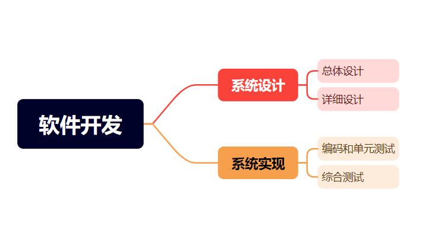


软件生命周期模型有瀑布模型，快速原型模型、增量模型、螺旋模型、喷泉模型。

软件生命周期模型是指**描述软件生命周期中各个阶段的顺序和关系的模型**。


## 2. chap 2

**可行性研究的任务，三个基本的可行性**

目的：不是解决问题，而是确定问题是否值得去解决

可行性研究必须从系统总体出发，对技术、经济、财务、商业以至环境保护、法律等多个方面进行分析和论证，以确定建设项目是否可行，为正确进行投资决策提供科学依据。

**技术可行性，经济可行性，操作可行性**


**系统流程图**

系统流程图是概括地描绘物理系统的传统工具。用图形符号以黑盒子形式描绘组成系统的每个部件。**不是对数据加工处理的控制过程**。

符号如下：

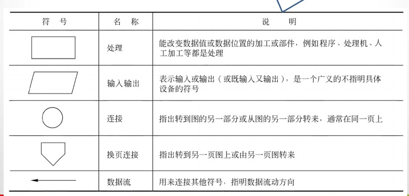


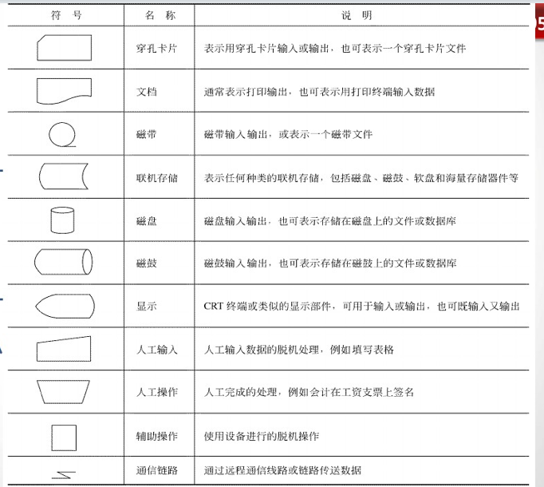


**数据流图**

数据流图(DFD)是一种图形化技术，它描绘信息流和数据从输入移动到输出的过程中所经受的**变换**。

设计数据流图只需考虑系统必须完成的基本逻辑功能。

数据流与程序流程图用箭头表示的控制流有本质不同。

四种基本符号

正方形表示数据的源点或终点
圆角矩形代表变换数据的处理
开口矩形代表数据存储
箭头表示数据流，即特定数据的流动方向
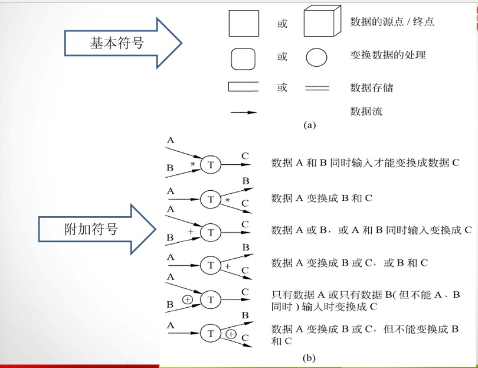


**数据字典的作用与符号表示**

作用：在软件分析和设计的过程中给人提供关于数据的描述信息。

数据字典的由对一下四类元素的定义组成：

‌**数据流**‌：表示数据在系统中的流动路径和方式。

‌**数据元素**（‌数据流分量）：描述系统中使用的具体数据项，包括其名称、类型、长度和取值范围。

‌**数据存储**‌：表示系统中存储的数据结构，如数据库表、文件等。

**处理**‌：描述系统中执行的操作和处理逻辑。


数据元素组成数据的方式：**顺序，选择，重复，可选**。

符号表示

```
= 等价于，定义为
+ 和，连接两个分量
[ ] 或，列出若干分量选择一个，|隔开待选择的分量
{} 重复，重复里面分量
() 可选，里面的分量可有可无
```

例子：标识符不超8位的字符串，首字符为字母，随后可以是字母也可以是数字

```
标识符=字母字符+字母数字串
字母数字串=0{字母或数字}7
字母或数字=[字母字符|数字字符]
```


## 3. Chap 3

需求分析的任务

最根本任务：确定系统必须完成哪些工作。

1.确定对系统的综合要求

2.分析系统的数据要求

3.导出系统的逻辑模型

4.修正系统开发计划


数据规范化的目的：减少数据冗余，避免出现插入异常或删除异常，简化修改数据的过程（避免多义性）。


系统的综合需求* p56

1.功能需求：必须提供的服务。

2.性能需求：必须满足的定时约束和容量约束

3.可靠性和可用性需求：定量的指定系统的可靠性

4.出错处理需求：对环境错误应该怎样响应

5.接口需求：应用系统与环境通信的格式

6.约束：设计和实现应遵守的限制条件

7.逆向需求：系统不应该做什么

8.将来可能提出的要求


与用户沟通获取需求的方法 p58

1.访谈

2.面向数据流自顶向下求精

3.简易的应用规格说明技术

4.快速建立软件模型


需求分析阶段建立的三种模型（对应三种工具）及其作用 p62

数据模型对应实体联系图，描绘数据对象及数据对象之间的关系。

功能模型对应数据流图，描绘当数据在软件系统中移动时被变换的逻辑过程，指明系统具有的变换数据的功能。

行为模型对应状态转换图，指明了作为外部事件结果的系统行为。


E-R图

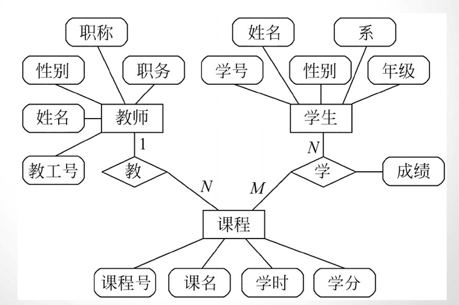


范式：定义消除数据冗余的程度。

第一范式，第二范式，第三范式 p65


状态转换图

状态转换图（简称为状态图）通过描绘系统的状态及引起系统状态转换的事件，来表示系统的行为。主要状态有：初态，终态，中间状态。

**初态只有一个，终态可有0个或多个。**

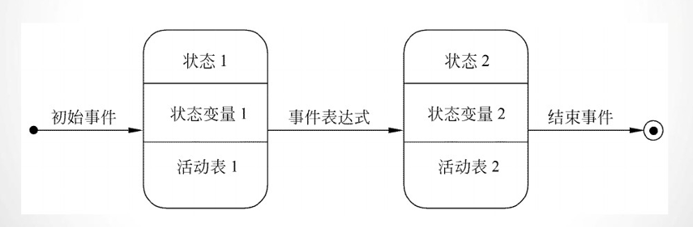


IPO图

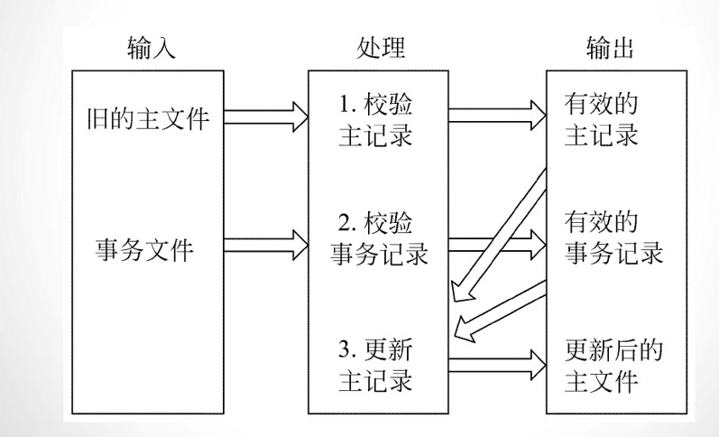


软件需求的正确性验证包含哪些内容 p70

一致性：所有需求必须是一致的，任何一条需求不能和其他需求互相矛盾
完整性：需求必须是完整的，规格说明书应该包括用户需要的每一个功能或性能。
现实性：指定的需求应该是用现有的硬件技术和软件技术基本上可以实现的。
有效性：必须证明需求是正确有效的，确实能解决用户面对的问题。


## 5. chap 5


总体设计过程包含的步骤* p92

1.设想供选择的方案

2.选取合理的方案

3.推荐最佳的方案

4.功能分解

5.设计软件结构

6.设计数据库

7.制定测试计划

8.书写文档

9.审查和复审


软件设计的基本原理 p94

包括：1.模块化（提高软件可维护性）

2.抽象

3.逐步求精

4.模块独立

5.信息隐藏与局部化


软件设计启发式规则* p100

1.改进软件结构提高模块独立性
2.模块规模应该适中
3.深度、宽度、扇出和扇入都应适当

4.模块作用域应该在控制域之内

5.力争降低模块接口的复杂程度

6.设计单入口单出口的模块

7.模块功能应该可以预测


深度、宽度、扇入、扇出

深度：软件结构中控制的层数
宽度：软件结构内同一个层次上的模块总数的最大值
扇出：一个模块直接控制（调用）的模块数目
扇入：一个模块被多少个上级模块直接调用的数目


模块独立性：耦合与内聚概念与排序

耦合是对一个软件结构内不同模块之间互连程度的度量。

尽量使用数据耦合，少用控制耦合和特征耦合，限制公共环境耦合的范围，完全不用内容耦合。

特征耦合，公共环境耦合。

低耦合：数据耦合

中耦合：控制耦合

高耦合：内容耦合。

内聚衡量一个模块内部各个元素彼此结合的紧密程度。

低内聚：偶然内聚，时间内聚，逻辑内聚

中内聚：过程内聚，通信内聚

高内聚：顺序内聚，功能内聚

**松散耦合，紧密内聚。**

**内容耦合耦合程度最高。**

**功能内聚内聚程度最高。**


数据流分析：变换型与事务型

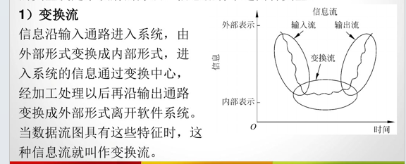


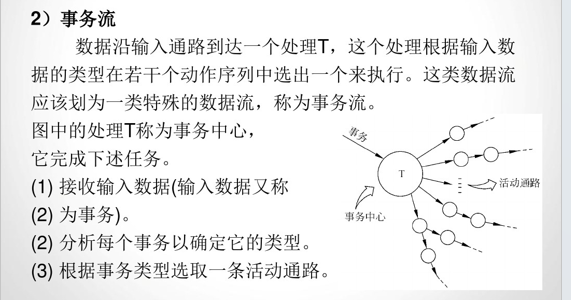

软件结构图

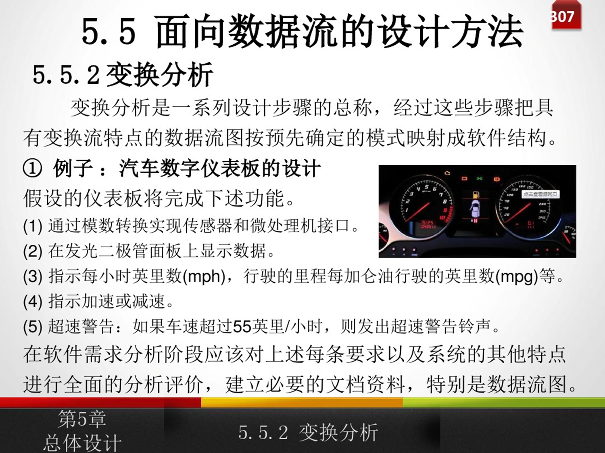

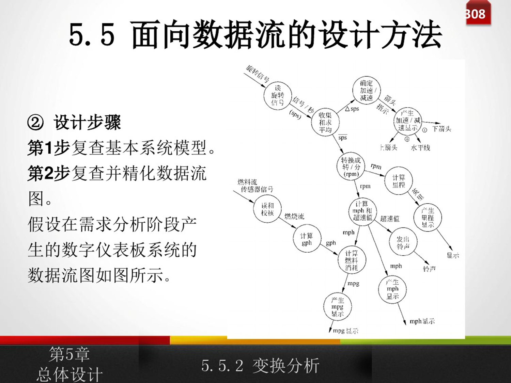

...

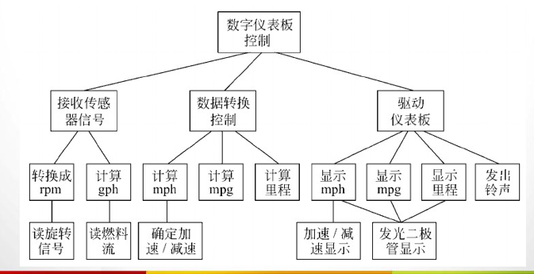

## 6. chap 6

软件详细设计阶段遵循原则与结构化思想

处理过程应具有可理解性

抽象，信息隐藏，模块化，一致性


三种基本、两种扩展以及修正的结构 p119

三种基本：顺序，选择，循环

两种扩展：`DO_UNTIL`型多分支结构和`DO_CASE`型循环结构

修正的结构：LEAVE(或BREAK)结构


NS图的特点

(1)功能域（即一个特定控制结构的作用域）明确，可以从盒图上一眼就看出来。
(2)不可能任意转移控制。
(3)很容易确定局部和全程数据的作用域。
(4)很容易表现嵌套关系，也可以表示模块的层次结构。


人机界面设计遇到四个问题：

1.系统响应时间
2.用户帮助设施
3.出错信息处理
4.命令交互。


NS盒图、程序流程图,相互转换* 

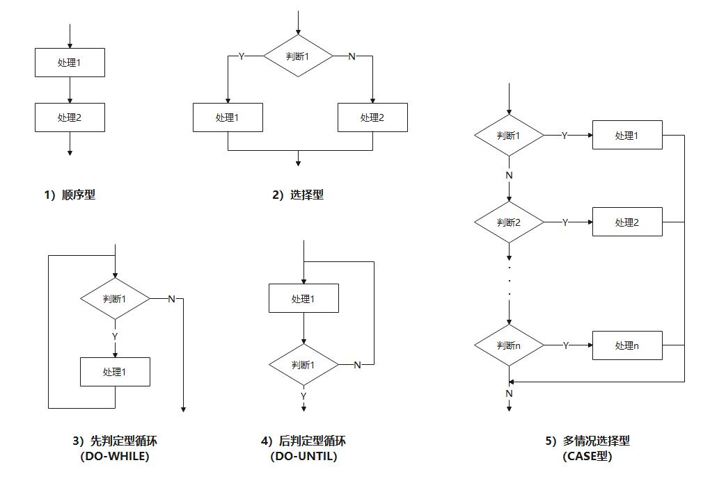


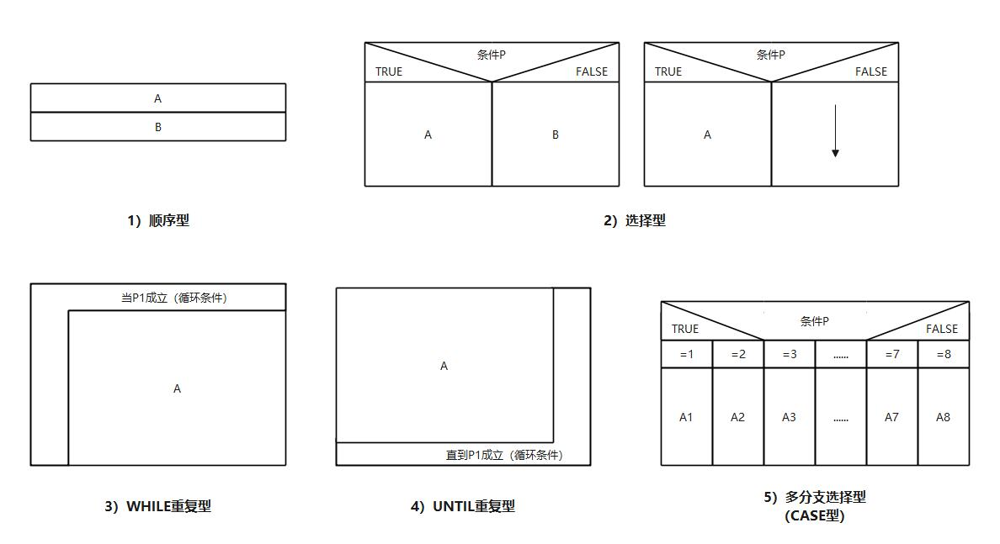


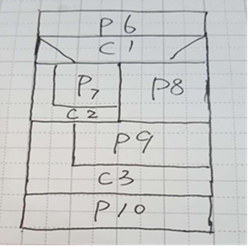

盒图转流程图

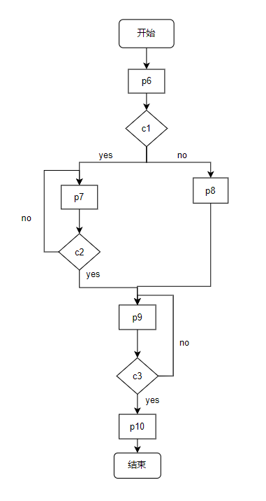


环形复杂度的定义与三种计算方法*

定义：对测试难度的一种定量度量

复合流图需要先拆分（比如a and b的判定节点拆成两个判定节点）

(1)流图中线性无关的区域数等于环形复杂度。
(2)流图G的环形复杂度V(G)=E-N+2,其中，E是流图中边的
条数，N是结点数。
(3)流图G的环形复杂度V(G)=P+1,其中，P是流图中判定结点的数目。

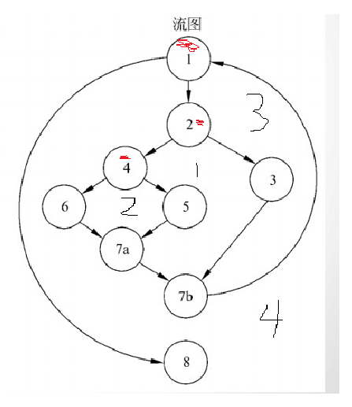

上图环形复杂度为4。

(1)流图中线性无关的区域数有4个。
(2)流图G的环形复杂度V(G)=11-9+2=4
(3)流图中判定结点的数目为3，环形复杂度3+1=4


## 7. chap 7

软件测试的目的与流程

目的：尽可能多的发现并排除软件中潜在的错误，最终把一个高质量的软件系统交给客户使用。

流程：1.模块测试

2.子系统测试

3.系统测试

4.验收测试

5.平行运行


白盒测试与黑盒测试的差别

(1)从测试原则看，黑盒测试主要是从用户角度出发，去测试数据的输入和输出关系的，因此黑盒测试不能够测试出外部特性的设计问题。白盒测试会测试每一个独立路径，相对更为全面一些；

(2)从测试对象看，黑盒测试用来测试用户会用到的前台展示，白盒测试用来测试后台的程序；

(3)从测试方式看，黑盒测试主要是测试**功能**，白盒测试是测试**代码结构**等；

(4)从测试目的看，黑盒测试主要检查接口和程序功能是否能正常使用，输入和输出是否正常。白盒测试检查的，是逻辑结构和逻辑路径，它会利用很多个检查点来测试运行状态。


## 8. chap 8

软件结构的四个类型

改正，完善，适应，预防
